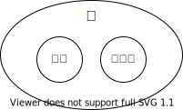

import Term from "@site/src/components/Term";

## <Term type="javascriptValue">値</Term>

次のコードを実行すると、`Hello World` が画面に表示されました。

```javascript title="script.js"
document.write("Hello World");
```

`"Hello World"` のように `"`（ダブルクォーテーション）で囲まれた<Term strong type="javascriptValue">値</Term>を、<Term strong type="javascriptString">文字列</Term>と呼びます。

<Term type="javascriptString">文字列</Term>は<Term type="javascriptValue">値</Term>の一種です。<Term type="javascriptNumber">数値</Term>は<Term type="javascriptString">文字列</Term>と同じ<Term type="javascriptValue">値</Term>の一種ですが、プログラムの中に直接記述することができます。



```javascript title="script.js"
document.write(3);
```

<p><Term strong type="javascriptOperator">演算子</Term>を用いると、<Term type="javascriptValue">値</Term>を用いて計算をすることができます。例えば <code>+</code>（加算<Term type="javascriptOperator">演算子</Term>）で、足し算の計算を行うことができます。</p>

```javascript title="script.js"
document.write(3 + 4);
```

## <Term type="javascriptOperator">演算子</Term>の<Term type="javascriptOperatorPriority">優先順位</Term>

<p><Term type="javascriptOperator">演算子</Term>には、<Term type="javascriptOperatorPriority">優先順位</Term>が設定されています。</p>

```javascript title="script.js"
document.write(3 + 4 * 5);
```

`*`（乗算<Term type="javascriptOperator">演算子</Term>）は `+` より<Term type="javascriptOperatorPriority">優先順位</Term>が高く設定されているため、上記のコードの実行結果は `23` となります。

このコードにおいて、`3 + 4 * 5` や、`4 * 5`、`4` を<Term strong type="javascriptExpression">式</Term>と呼びます。また、<Term type="javascriptExpression">式</Term>が計算され、その結果としての<Term type="javascriptValue">値</Term>が確定することを式が<Term strong type="javascriptEvaluation">評価</Term>されるといいます。

`3 + 4 * 5` の<Term type="javascriptEvaluation">評価</Term>は、先に `4 * 5` が<Term type="javascriptEvaluation">評価</Term>されて `20` になり、次に `3 + 20` が<Term type="javascriptEvaluation">評価</Term>されることにより、`23` という<Term type="javascriptValue">値</Term>となると考えることができます。

## いろいろな<Term type="javascriptOperator">演算子</Term>

<p><Term type="javascriptOperator">演算子</Term>が適用できるのは、何も<Term type="javascriptNumber">数値</Term>だけではありません。<Term type="javascriptString">文字列</Term>に適用できる<Term type="javascriptOperator">演算子</Term>もあります。先ほどの <code>+</code>（加算<Term type="javascriptOperator">演算子</Term>）は、<Term type="javascriptString">文字列</Term>同士で使用された場合は、<Term type="javascriptString">文字列</Term>結合<Term type="javascriptOperator">演算子</Term>となります。</p>

```javascript title="script.js"
document.write("Hello" + "World");
```

画面には `HelloWorld` と表示されるはずです。

もう少し複雑な例を見てみましょう。

```javascript title="script.js"
document.write(3 + 4 + "Hello");
document.write("Hello" + 1 + 2);
```

このような場合、<Term type="javascriptOperator">演算子</Term>の**結合規則**を考える必要があります。

`+` の結合規則は左から右なので、`3 + 4 + "Hello"` は `(3 + 4) + "Hello"`、`"Hello" + 1 + 2` は`("Hello" + 1) + 2`と解釈されることになります。

`+` は、両辺が<Term type="javascriptNumber">数値</Term>の場合のみ加算<Term type="javascriptOperator">演算子</Term>として振る舞い、片方が<Term type="javascriptNumber">数値</Term>で片方が<Term type="javascriptString">文字列</Term>の場合は<Term type="javascriptNumber">数値</Term>を<Term type="javascriptString">文字列</Term>に変換してから<Term type="javascriptString">文字列</Term>結合<Term type="javascriptOperator">演算子</Term>として機能します。このため、最終的な<Term type="javascriptExpression">式</Term>全体の<Term type="javascriptEvaluation">評価</Term>結果は前者が `"7Hello"` 、後者が `"Hello12"` となるのです。

### 代表的な演算子

| 演算子 | 説明     | 例                                  |
| ------ | -------- | ----------------------------------- |
| `+`    | 　足す   | `1 + 1 === 2 ` `"A" + "B" === "AB"` |
| `-`    | 　引く   | `2 - 1 === 1`                       |
| `*`    | 　掛ける | `2 * 2 === 4`                       |
| `/`    | 　割る   | `4 / 2 === 2`                       |
