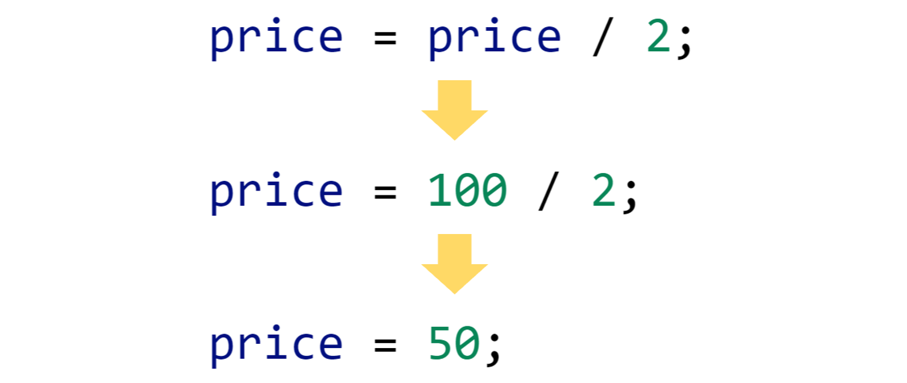

import Term from "@site/src/components/Term";
import ViewSource from "@site/src/components/ViewSource";

## <Term type="javascriptVariable">変数</Term>とは

<p><Term type="javascriptVariable">変数</Term>を用いると、<Term type="javascriptValue">値</Term>を一時的に保存し、再利用することができます。数学における変数は通常数値を表すものですが、プログラムにおける<Term type="javascriptVariable">変数</Term>は、<Term type="javascriptString">文字列</Term>等を含め、全ての種類の「<Term type="javascriptValue">値</Term>」を格納することができます。</p>

## <Term type="javascriptVariable">変数</Term>の<Term type="javascriptDeclaration">宣言</Term>と使用

<p><Term type="javascriptVariable">変数</Term>を使用するには、まず<Term type="javascriptVariable">変数</Term>を<Term strong type="javascriptDeclaration">宣言</Term>する必要があります。</p>

```javascript title="script.js"
let myGreatName = "Becky Jones";
document.write(myGreatName);
```

`let` は、<Term type="javascriptVariable">変数</Term>を<Term type="javascriptDeclaration">宣言</Term>するためのキーワードです。 1 行目では、`myGrateName` という名前の<Term type="javascriptVariable">変数</Term>を<Term type="javascriptDeclaration">宣言</Term>し、そこに`"Becky Jones"` という文字列を保存しています。<Term type="javascriptVariable">変数</Term>に`=` を使って<Term type="javascriptValue">値</Term>を保存することを<Term type="javascriptAssignment">代入</Term>と呼びます。

2 行目では、<Term type="javascriptVariable">変数</Term> `myGreatName` が<Term type="javascriptEvaluation">評価</Term>され、<Term type="javascriptAssignment">代入</Term>されていた<Term type="javascriptString">文字列</Term><Term type="javascriptValue">値</Term> `"Becky Jones"` が画面に表示されます。

<p><Term type="javascriptVariable">変数</Term>を<Term type="javascriptDeclaration">宣言</Term>するキーワードには、<code>let</code> 以外にも<code>const</code> というものがあります。記法自体は<code>let</code> と同様です。</p>

```javascript title="script.js"
const myGrateName = "Becky Jones";
document.write(myGrateName);
```

ここまでの例では、`my great name` というフレーズを、`myGreatName` のように記述しています。

このように、複数の単語にわたるフレーズを、2 語目以降の先頭の文字を大文字にして結合する命名規則を、<Term strong type="camelCase">キャメルケース</Term>と呼びます。

:::info

<p><Term type="javascript">JavaScript</Term> の<Term type="javascriptVariable">変数</Term>名には、通常<Term type="camelCase">キャメルケース</Term>が用いられます。<Term type="snakeCase">スネークケース</Term>や<Term type="pascalCase">パスカルケース</Term>などの命名規則が利用される文法もあります。</p>

:::

:::tip

<Term type="javascriptVariable">変数</Term>や<Term type="javascriptFunction">関数</Term>は適切に命名することが大切です。以下の例を見てみましょう。

```javascript
const a = 500;
const b = 3;
const c = a * b;
document.write(c);
```

```javascript
const pricePerItem = 500;
const numberOfItems = 3;
const paymentTotal = pricePerItem * numberOfItems;
document.write(paymentTotal);
```

この二つでは、前者は何を言いたいのかさっぱりですが、後者はコードを通じて書きたいことが分かりやすく、後から読み返しても困りません。他人と開発を行うときや、過去のコードを自分が書き換えるときには、コードの可読性が必要になります。変数名は多少長くなっても良いので、とにかく分かりやすいことを心がけましょう。

:::

## <Term type="javascriptVariable">変数</Term>の再代入

`let` と`const` の大きな違いは、再<Term type="javascriptAssignment">代入</Term>ができるかです。`let` では再<Term type="javascriptAssignment">代入</Term>が可能ですが、`const` はできません。

```javascript title="script.js"
let mysteriousNumber = 0;
mysteriousNumber = 1;
mysteriousNumber = 2;
document.write(mysteriousNumber); // 2
```

上の例では、<Term type="javascriptVariable">変数</Term>の<Term type="javascriptValue">値</Term>が次々と変化しています。`let` で<Term type="javascriptDeclaration">宣言</Term>された<Term type="javascriptVariable">変数</Term>は最後に<Term type="javascriptAssignment">代入</Term>された<Term type="javascriptValue">値</Term>のみを保持します。<Term type="javascriptVariable">変数</Term> `mysteriousNumber` は 3 回<Term type="javascriptAssignment">代入</Term>されていますが、最後に<Term type="javascriptAssignment">代入</Term>された `2` が表示されます。

一方、`const` で<Term type="javascriptDeclaration">宣言</Term>された<Term type="javascriptVariable">変数</Term>は、再<Term type="javascriptAssignment">代入</Term>ができません。すなわち、<Term type="javascriptValue">値</Term>の書き換えができません。上記のコードの`let` を`const` に置き換えると、エラーが発生します。

`let` を使った<Term type="javascriptVariable">変数</Term>の<Term type="javascriptDeclaration">宣言</Term>について、もう少し見てみましょう。

```javascript title="script.js"
let price = 100;
price = price / 2;
document.write(price);
```

<ViewSource url={import.meta.url} path="_samples/compound-assignment" />

<p><Term type="javascriptAssignment">代入</Term><Term type="javascriptOperator">演算子</Term>は、まず右辺の<Term type="javascriptExpression">式</Term>を<Term type="javascriptEvaluation">評価</Term>します。これにより、右辺は <code>100 / 2</code> となります。よって、最終的に<Term type="javascriptVariable">変数</Term> <code>price</code> の<Term type="javascriptValue">値</Term>は <code>50</code> となり、これは <code>price</code> を半分にする操作に対応します。</p>



## constとletの用途

`const` と`let` は用途によって使い分けがあります。基本的には、意図せず<Term type="javascriptValue">値</Term>を書き換えてしまうことを防ぐために`const` が使われます。`let` が必要な場合は様々ですが、状態を保存しておくための<Term type="javascriptVariable">変数</Term>を<Term type="javascriptDeclaration">宣言</Term>することに使われることが多いです。[繰り返し](./../08-loop/)の章にあるカウンタ<Term type="javascriptVariable">変数</Term>がその一例です。他にも、<Term type="javascriptVariable">変数</Term>の値を踏まえて条件分岐を行うなど、様々な用途があります。

```javascript title="script.js"
let i = 0;
while (i < 5) {
  i += 1;
  document.write("Hello world!");
}
```
