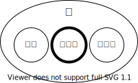

import Term from "@site/src/components/Term";
import ViewSource from "@site/src/components/ViewSource";

## <Term type="javascriptBoolean">論理値</Term>

<p><Term type="javascript">JavaScript</Term> で利用できる「<Term type="javascriptValue">値</Term>」として、これまで<Term type="javascriptString">文字列</Term>と<Term type="javascriptNumber">数値</Term>を扱いました。JavaScript ではこの他に、<Term strong type="javascriptBoolean">論理値</Term> と呼ばれる、「正しいか、正しくないか」を表すための<Term type="javascriptValue">値</Term>が存在します。</p>

<p><Term type="javascriptBoolean">論理値</Term>は、<code>true</code>（真）または <code>false</code>（偽）の２つだけです。ダブルクォーテーションは必要ありません。通常の<Term type="javascriptValue">値</Term>ですので、<Term type="javascriptVariable">変数</Term>に<Term type="javascriptAssignment">代入</Term>したり、計算に使ったりすることができます。</p>



## 論理<Term type="javascriptOperator">演算子</Term>

<p><Term type="javascriptBoolean">論理値</Term>に対して適用できる<Term type="javascriptOperator">演算子</Term>が存在します。</p>

```javascript
let isMonsterBig = true;
let isMonsterSmall = !true; // false
let isHunterStrong = false;
let shouldEscape = !isHunterStrong && isMonsterBig; // true
let shouldFight = isHunterStrong || isMonsterSmall; // false
```

詳細は以下の通りです。 `!` のみが作用する対象を 1 つしかとらないことに注意してください。

| 演算子                    | 意味       | 詳細                                                                 |
| ------------------------- | ---------- | -------------------------------------------------------------------- |
| `!`                       | ～ではない | `true` ならば `false`、`false` ならば `true`                         |
| `&&`                      | かつ       | 両方 `true` ならば `true`、どちらか 1 つでも `false` ならば `false`  |
| <code>&#124;&#124;</code> | または     | 両方 `false` ならば `false` 、どちらか 1 つでも `true` ならば `true` |

## 比較<Term type="javascriptOperator">演算子</Term>

比較<Term type="javascriptOperator">演算子</Term>は、複数の<Term type="javascriptValue">値</Term>を比較して、単一の<Term type="javascriptBoolean">論理値</Term>を得ます。

```javascript
let age = 15;
let height = 155;
let isFourteen = age === 14; // false
let isNotFourteen = age !== 14; // true
let isChild = age < 20; // true
let canRideRollerCoasters = age >= 10 && height >= 140; // true
```

各<Term type="javascriptOperator">演算子</Term>の詳細は、次の通りです。

| 演算子 | 意味       | 詳細                            |
| ------ | ---------- | ------------------------------- |
| `===`  | 等しい     |                                 |
| `!==`  | 等しくない |                                 |
| `<`    | 小なり     | 左辺が右辺より小さければ `true` |
| `<=`   | 以下       | 左辺が右辺より以下ならば `true` |
| `>`    | 大なり     | 左辺が右辺より大きければ `true` |
| `>=`   | 以上       | 左辺が右辺より以上ならば `true` |

`&&` や `||` よりも比較<Term type="javascriptOperator">演算子</Term>の方が<Term type="javascriptOperatorPriority">優先順位</Term>が高いため、最後の例のように複数の条件を「かつ」「または」などで組み合わせることは容易です。

## 課題

次のコードは何を表示するでしょうか。そしてそれはなぜでしょうか。

```javascript
let takaoHeight = 599;
let everestHeight = 8849;
let fujiHeight = 3776;
document.write(takaoHeight < everestHeight < fujiHeight);
document.write(takaoHeight = everestHeight);
```

<ViewSource path="/docs/1-trial-session/06-boolean/_samples/weird-comparison" />

- JavaScript で、数値と論理値に比較<Term type="javascriptOperator">演算子</Term>を適用すると、`true` は `1` として、`false` は `0` として比較されます。
- `=` は代入演算子です。代入<Term type="javascriptOperator">演算子</Term>の<Term type="javascriptExpression">式</Term>が<Term type="javascriptEvaluation">評価</Term>されると、右辺の<Term type="javascriptValue">値</Term>になります。
