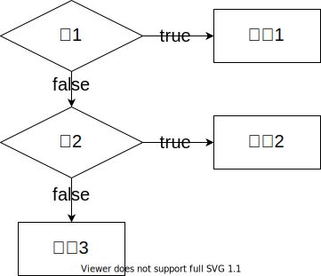

import Term from "@site/src/components/Term";
import OpenInCodeSandbox from "@site/src/components/OpenInCodeSandbox";

## if 構文

**if 構文**は、<Term type="javascript">JavaScript</Term>の<Term strong type="javascriptControlFlow">制御構造</Term>で、特定の条件下のみで実行されるプログラムを記述することができます。

## 基本構造

```javascript
let age = 18;
if (age < 20) {
  document.write("未成年者の場合は法定代理人の同意が必要です。");
}
```

このプログラムは、 `未成年者の場合は法定代理人の同意が必要です。` と表示しますが、1 行目を `let age = 20;` に変更すると何も表示されなくなります。

2 行目の `if (age < 20) {` 部分がポイントです。ここに差し掛かると、括弧内の<Term type="javascriptExpression">式</Term> `age < 20` が<Term type="javascriptEvaluation">評価</Term>され、`true` になります。このため、直後の波括弧内の処理が実行されます。

if 文の基本構造は

```javascript
if (式) {
  処理;
}
```

で、<Term type="javascriptExpression">式</Term>の<Term type="javascriptEvaluation">評価</Term>結果が `true` であれば処理が実行されます。

## if ～ else

if ～ else 構文を用いると、条件が満たされなかったときの処理を記述できます。

```javascript
if (式) {
  処理1;
} else {
  処理2;
}
```

<p><Term type="javascriptExpression">式</Term>の<Term type="javascriptEvaluation">評価</Term>結果が <code>true</code> であれば処理 1 が、<code>false</code> であれば処理 2 が実行されます。</p>

```javascript
let age = 18;
if (age >= 20) {
  document.write("大人です");
} else {
  document.write("子供です");
}
```

この例では、`age >= 20` の<Term type="javascriptEvaluation">評価</Term>が `false` となるので、`子供です` が表示されます。

## if ～ else if ～ else

if ～ else if ～ else 構文を使うと、複数の条件を重ねることができます。

```javascript
if (式1) {
  処理1;
} else if (式2) {
  処理2;
} else {
  処理3;
}
```



## 演習

自分の年齢を<Term type="javascriptVariable">変数</Term>に入れておきます。

```javascript
let age = 20;
```

下を満たすプログラムを作成してください。

- 18 歳未満なら `選挙権はありません` と表示する
- 18 歳以上 ～ 25 歳未満なら `投票に行けます` と表示する
- 25 歳以上なら `衆議院議員に立候補できます` と表示する

<OpenInCodeSandbox path="/docs/1-trial-session/07-if-statement/samples/the-right-to-vote" />
