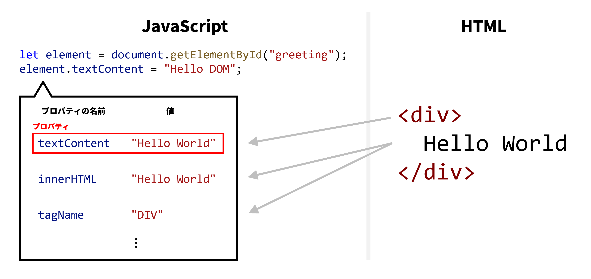

## <Term type="html">HTML</Term> 要素を <Term type="javascript">JavaScript</Term> で取得する

<p><Term strong type="dom">DOM</Term>（Document Object Model）は、<Term type="html">HTML</Term> 構造を <Term type="javascript">JavaScript</Term> の<Term type="javascriptObject">オブジェクト</Term>として扱うための枠組みです。<Term type="html">HTML</Term> と <Term type="css">CSS</Term> のほとんどの機能は <Term type="javascript">JavaScript</Term> から制御することができます。</p>

`document.getElementById` <Term type="javascriptFunction">関数</Term>は、<Term type="javascriptParameter">引数</Term>として <Term type="element">HTML 要素</Term>の `id` <Term type="attribute">属性</Term>に指定された値を<Term type="javascriptString">文字列</Term>として<Term type="javascriptPass">渡す</Term>ことで、その<Term type="element">要素</Term>を表す<Term type="javascriptObject">オブジェクト</Term>を<Term type="javascriptReturn">返し</Term>ます。

```html title="index.html"
<div id="greeting">Hello World</div>
```

```js title="script.js"
const element = document.getElementById("greeting");
element.textContent = "Hello DOM";
```

<ViewSource url={import.meta.url} path="_samples/get-element-by-id" />

<p><Term type="javascriptVariable">変数</Term> <code>element</code> には、<code>index.html</code> に記述された <code>div</code> <Term type="element">要素</Term>に対応する<Term type="javascriptObject">オブジェクト</Term>が<Term type="javascriptAssignment">代入</Term>されています。</p>



`document.getElementById` が<Term type="javascriptReturn">返す</Term><Term type="javascriptObject">オブジェクト</Term>には、取得した HTML <Term type="element">要素</Term>の特徴を表す、たくさんの<Term type="javascriptProperty">プロパティ</Term>が含まれています。下はその一部分です。

| プロパティ    | 説明                                                 |
| ------------- | ---------------------------------------------------- |
| `textContent` | <Term type="element">要素</Term>内部のテキスト       |
| `innerHTML`   | <Term type="element">要素</Term>内部の HTML          |
| `tagName`     | <Term type="tag">タグ</Term>の名前                   |
| `style`       | <Term type="element">要素</Term>に設定されたスタイル |

`textContent` <Term type="javascriptProperty">プロパティ</Term>は、<Term type="element">HTML 要素</Term>の内部のテキストを表します。<Term type="javascriptObject">オブジェクト</Term>の<Term type="javascriptProperty">プロパティ</Term>は通常の<Term type="javascriptVariable">変数</Term>のように取得や<Term type="javascriptAssignment">代入</Term>が可能で、上の例では `textContent` <Term type="javascriptProperty">プロパティ</Term>に対して `"Hello DOM"` という<Term type="javascriptString">文字列</Term>を代入することで、`div` <Term type="element">要素</Term>の内部のテキストを変更しています。

## <Term type="element">HTML 要素</Term>のスタイルを変更する

`document.getElementById` <Term type="javascriptFunction">関数</Term>が返す<Term type="javascriptObject">オブジェクト</Term>の `style` <Term type="javascriptProperty">プロパティ</Term>は、その要素の <Term type="styleAttribute">`style` 属性</Term>と対応します。**`style` <Term type="javascriptProperty">プロパティ</Term>に格納されている<Term type="javascriptValue">値</Term>自体も<Term type="javascriptObject">オブジェクト</Term>**となっており、その各<Term type="javascriptProperty">プロパティ</Term>が CSS の<Term type="cssProperty">プロパティ</Term>に対応します。

```js title="script.js"
element.style.backgroundColor = "red";
```

このプログラムは、取得した<Term type="element">要素</Term>の背景色を赤色に変更します。


<p><Term type="css">CSS</Term> の<Term type="cssProperty">プロパティ</Term>名である <code>background-color</code> は、内部にハイフンが含まれているため、<code>element.style.background-color</code>のように指定してしまうと、ハイフンが減算<Term type="javascriptOperator">演算子</Term>として解釈されてしまいます。
<code>style</code> <Term type="javascriptProperty">プロパティ</Term>では、<Term type="css">CSS</Term> の<Term type="cssProperty">プロパティ</Term>名は<Term type="camelCase">キャメルケース</Term>として指定する必要があることに注意してください。</p>

## DOM を用いて要素を追加する

`document.createElement` 関数は、引数に要素の種類を表す文字列を取り、その種類の新しい HTML 要素を作る関数です。
`document.createElement` 関数の戻り値は、新しく作った HTML 要素に対応するオブジェクトです。
下の例では、新しい `button` 要素を作っています。
中身のない空の要素が作成されるので、`textContent` を `Hello World!` に設定してみましょう。

```js title="script.js"
const newButton = document.createElement("button");
newButton.textContent = "Hello World!";
```

そして、`要素1.appendChild(要素2)` とすることで、要素2を要素1の子要素に追加し、画面に表示することができます。
今回は、`div` 要素の子要素にしてみましょう。

```html title="index.html"
<div id="parent-element"></div>
```

```js title="script.js"
const parent = document.getElementById("parent-element");

const newButton = document.createElement("button");
newButton.textContent = "Hello World!";

parent.appendChild(newButton);
```

これで、既存の `div` 要素の子要素に新しい `button` 要素が追加され、画面に `Hello World!` と書いてあるボタンが表示されます。

## 初級課題

### 買い物リストの書き換え

次の HTML ファイルから読み込んでいる JavaScript ファイルを書き換えて、「トマト」「レモン」「バジル」と表示されるようにしてみましょう。

```html title="index.html"
<ul>
  <li id="item1">トマト</li>
  <li id="item2">ナス</li>
  <li id="item3">バジル</li>
</ul>
```

<Answer title="買い物リストの書き換え">

```js title="script.js"
const targetItem = document.getElementById("item2");

targetItem.textContent = "レモン";
```

<ViewSource url={import.meta.url} path="_samples/change-shopping-memo" />

</Answer>

## 中級課題

### フルーツバスケット

購入する予定の果物を表す文字列が格納された配列が次のように用意されています。

```js
const fruits = ["イチゴ", "スイカ", "バナナ"];
```

`createElement` 関数や `appendChild` 関数を用い、`ul` 要素の中に各果物に対応する `li` 要素を作成することで、箇条書きを完成させましょう。
ただし、HTML ファイルの body タグの中には次のように記述されているものとします。

```html title="index.html"
<ul id="fruit-basket"></ul>
```

<Answer title="フルーツバスケット">

```js title="script.js"
const basket = document.getElementById("fruit-basket");
const fruits = ["イチゴ", "スイカ", "バナナ"];

for (const fruit of fruits) {
  const item = document.createElement("li");
  item.textContent = fruit;
  basket.appendChild(item);
}
```

<ViewSource url={import.meta.url} path="_samples/fruit-basket" />

</Answer>
