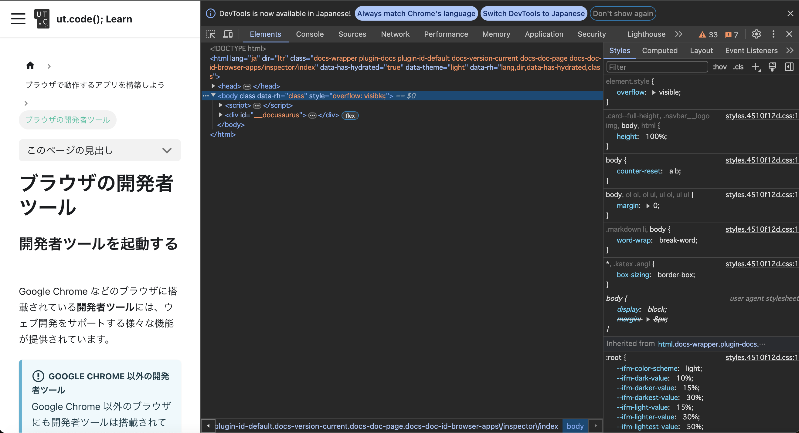

import CodeBlock from '@theme/CodeBlock';
import Term from "@site/src/components/Term";
import ViewSource from "@site/src/components/ViewSource";
import inspectElementsVideo from "./inspect-elements.mp4";
import { GrSelect } from "react-icons/gr";

## 開発者ツールを起動する

Google Chrome などのブラウザに搭載されている**開発者ツール**には、ウェブ開発をサポートする様々な機能が提供されています。

:::info Google Chrome 以外の開発者ツール

Google Chrome 以外のブラウザにも開発者ツールは搭載されています。ほとんど同等の機能が提供されているので、基本的にはどれを使っても構いません。しかしながら、Google Chrome のものが最も多く使用されており、本カリキュラムでも基本的には Google Chrome を用いるものとします。

:::

開発者ツールは、`Cmd (Ctrl) + Opt (Shift) + I` キー、もしくは `F12` キーを押すことにより起動できます。



## HTML や CSS の構造の確認

`Elements` タブを用いると、ウェブサイト上に現在表示されている HTML の構造や、各 HTML 要素に適用されている CSS の状態を確認したり、その場で値を書き換えて、表示が変化する様子を確認したりすることができます。

また、表示中の HTML 要素を右クリックして `検証` メニューをクリックするか、開発者ツールの中のインスペクトボタン (<GrSelect style={{ verticalAlign: "middle" }} />) をクリックすることにより、要素を直接選択することができます。この方法を用いることで、HTML の木構造を根から辿る必要がなくなります。

<video src={inspectElementsVideo} muted autoPlay loop controls />

### 課題

あなたのお気に入りのニュースサイトの記事をひとつ選び、その中に現れる人物名を、 `Elements` タブの機能を用いて自分の名前に変えてみましょう。悪用厳禁です！

## デバッガ

**デバッガ** は、プログラムのバグを探し、解決するために役立つソフトウェアです。ブラウザの開発者ツールには、通常 JavaScript のデバッガが搭載されています。

デバッガを用いることで、プログラムが実行される様子を細かく観測することができます。次のプログラムで試してみましょう。

```html title="index.html"
<!doctype html>
<html lang="ja">
  <head>
    <meta charset="utf-8" />
    <title>Title</title>
  </head>
  <body>
    <div id="result"></div>
    <script src="./script.js"></script>
  </body>
</html>
```

```javascript title=script.js
function add(a, b) {
  return a + b;
}

const resultElement = document.getElementById("result");
const sum = add(3, 4);
resultElement.textContent = sum;
```

JavaScript のデバッガは主に `Sources` タブから用います。まずはこのタブを開き、サイドパネルに表示された `script.js` を開きましょう。


続いて、5 行目の行番号が表示されている部分をクリックして**ブレークポイント**を設置します。この状態でブラウザを更新してみてください。

JavaScript の実行がブレークポイントを設定した地点に差し掛かると、プログラムの実行がデバッガにより一時停止されます。

:::info

上記のプログラムにおいて、ページの読み込みの完了時にはすでに JavaScript の実行が終わっています。このため、ブレークポイントを設置した行のプログラムは、ページを更新するまで再度実行されません。

:::

:::caution

下の画像の中の、緑色の四角で表示されている部分は、**これから実行されようとしている行**を表します。つまり、5 行目のプログラムは、この時点ではまだ実行されていません。

:::


続いて、**ステップ オーバー**ボタンを押します。ステップ オーバーは、現在の行を実行し、次の行に進む操作です。これにより、緑色の四角が 6 行目に移ります。


この状態で、`resultElement` の部分にマウスカーソルを乗せてみましょう。`resultElement` 変数の中身が表示されます。変数の値がオブジェクトの場合は、その内部を見ることもできます。おなじみの `textContent` プロパティなども存在していることが分かりますね。


次は、**ステップ イン**ボタンを押してみましょう。現在の行が関数呼び出しだった場合、実行が関数の中に移ります。


右側のパネルの `Call Stack` (**コール スタック**) 部分を見てみてください。ここには、現在実行されている関数が、どの順番で実行されているのかが表示されています。この場合は、`script.js` というファイルの 6 行目から `add` 関数が呼び出されていることが分かります。


最後に、**ステップ アウト**ボタンを押しましょう。このボタンを押すと、現在実行されている関数が最後まで実行され、呼び出し元の関数の実行に戻ります。


:::tip `console.log`

デバッガを使わずに、`console.log` を使ってデバッグすることもできます。`console.log` は、ブラウザの開発者ツールの `Console` に値を出力する関数です。
以下のプログラムは `x` と `y` の和を出力するプログラムですが、`console.log` を使ってプログラムの実行中に値の変化を確認したり、エラーが発生した際に原因を特定することができます。

```javascript
const x = 5;
const y = 10;
const sum = x + y;
console.log("x + y = ", sum);
```

:::

### 課題

次のプログラムの 5 行目では、`add` 関数は 3 回実行されます。どのような順番で関数が呼び出されているか、デバッガを用いて確認してみてください。

```javascript title=script.js
function add(a, b) {
  return a + b;
}

const result = add(add(1, 2), add(3, 4));
document.write(result);
```
