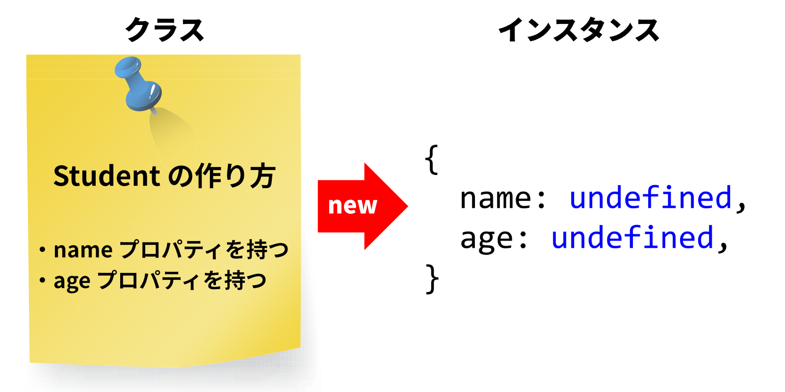

import CodeBlock from '@theme/CodeBlock';
import Term from "@site/src/components/Term";
import ViewSource from "@site/src/components/ViewSource";
import Answer from "@site/src/components/Answer";

## <Term type="javascriptClass">クラス</Term>と<Term type="javascriptInstance">インスタンス</Term>

オブジェクトを使うと、複数の値をひとまとまりに扱うことができました。実世界においては、同じ<Term type="javascriptProperty">プロパティ</Term>(属性)を持つ<Term type="javascriptObject">オブジェクト</Term>を多く扱う場合が多いです。例えば、学生を<Term type="javascriptObject">オブジェクト</Term>として表すことを考えてみましょう。学生には必ず名前と年齢という属性があるはずなので、ひとまず `name` と `age` を<Term　type="javascriptProperty">プロパティ</Term>に持つとしましょう。

```javascript
const tanaka = {
  name: "田中",
  age: 18,
};
```

同じ属性を持つ<Term type="javascriptObject">オブジェクト</Term>を複数生成するときに役立つのが**<Term type="javascriptClass">クラス</Term>**です。<Term type="javascriptClass">クラス</Term>では、<Term type="javascriptObject">オブジェクト</Term>の<Term type="javascriptProperty">プロパティ</Term>を予め設定しておくだけでなく、下の<Term type="javascriptMethod">メソッド</Term>の節で説明するように、<Term type="javascriptProperty">プロパティ</Term>を引数にもつような関数も設定しておくことができます。これにより、同じコードを何度も書く必要がなくなるというメリットがあります。<Term type="javascriptClass">クラス</Term>は、同じ<Term type="javascriptProperty">プロパティ</Term>を持つ<Term type="javascriptObject">オブジェクト</Term>を統一的に扱うための仕組みであり、<Term type="javascriptObject">オブジェクト</Term>の設計図と言えます。

次のコードでは、先ほど作った `tanaka` のように `name` や `age` という<Term type="javascriptProperty">プロパティ</Term>を持つ<Term type="javascriptObject">オブジェクト</Term>の設計図として、<Term type="javascriptClass">クラス</Term> `Student` を定義しています。<Term type="javascriptClass">クラス</Term>では、この例の `age` <Term type="javascriptProperty">プロパティ</Term>のように、デフォルトの値を設定することができます。

```javascript
class Student {
  name; // name プロパティを作成する
  age = 18; // age プロパティのデフォルト値として `18` を使用する
}
```

:::info

<Term type="javascriptClass">クラス</Term>の名前は、通常の<Term type="camelCase">キャメルケース</Term>の最初の文字を大文字にした<Term type="pascalCase">パスカルケース</Term>で記述するのが普通です。

:::

`new` 演算子を<Term type="javascriptClass">クラス</Term>に対して適用すると、設計図に基づいて<Term type="javascriptObject">オブジェクト</Term>が作成されます。こうしてできた<Term type="javascriptObject">オブジェクト</Term>を、もとになった<Term type="javascriptClass">クラス</Term>の**<Term type="javascriptInstance">インスタンス</Term>**と呼びます。今回の `age` <Term type="javascriptProperty">プロパティ</Term>のように、<Term type="javascriptClass">クラス</Term>の<Term type="javascriptProperty">プロパティ</Term>にデフォルトの値が設定されている場合、新たな値を代入するまではデフォルト値が入ります。もちろん、<Term type="javascriptProperty">プロパティ</Term>に新たな値を代入してデフォルト値を書き換えることもできます。

```javascript
const tanaka = new Student(); // Student クラスをもとにオブジェクトを作成する

tanaka.name = "田中"; // name プロパティに代入
document.write(tanaka.age); // age プロパティのデフォルト値は 18
```



:::tip `undefined` という値

上で定義した `Student` <Term type="javascriptClass">クラス</Term>には、デフォルト値の指定されていない<Term type="javascriptProperty">プロパティ</Term> `name` が存在します。`new Student` をした直後の<Term type="javascriptObject">オブジェクト</Term>の `name` <Term type="javascriptProperty">プロパティ</Term>の値はどうなっているのでしょうか。

実は、JavaScript には、未定義であることを表す特殊な値 `undefined` が存在しています。これまで、JavaScript の値には数値、文字列、論理値、<Term type="javascriptObject">オブジェクト</Term>があるとしてきましたが、これらとはまた別の値です。

存在しない<Term type="javascriptProperty">プロパティ</Term>の値、値を返さない関数の戻り値などは、すべて `undefined` となります。

```javascript
const emptyObject = {};
function emptyFunction() {}

document.write(emptyObject.unknownProperty); // 存在しないプロパティは undefined
document.write(emptyFunction()); // 値を返さない関数の戻り値は undefined
```

:::

### 課題

`weight` と `cost` をプロパティとして持ち、 `weight` のデフォルト値が `"1t"` であるクラス `Car` を作成し、 `cost` に好きな値を代入してみましょう。

<ViewSource url={import.meta.url} path="_samples/class-car" />

## <Term type="javascriptMethod">メソッド</Term>

同じ<Term type="javascriptProperty">プロパティ</Term>を持つ<Term type="javascriptObject">オブジェクト</Term>に対しては、同じような処理を行うことが多いです。例えば、学生はたいてい最初の授業で自己紹介をします。そこで、 `Student` <Term type="javascriptClass">クラス</Term>に、自己紹介をする関数 `introduceSelf()` を設定してみましょう。

オブジェクトに対して定義されている関数を**<Term type="javascriptMethod">メソッド</Term>**と呼びます。<Term type="javascriptMethod">メソッド</Term>の定義は<Term type="javascriptClass">クラス</Term>定義の中で行われますが、関数と異なり、`function` キーワードを必要としません。

```javascript
class Student {
  name;
  age;

  // メソッド introduceSelf を定義する
  introduceSelf() {
    // this は作成されたインスタンスを指す
    document.write(`私の名前は${this.name}です。${this.age}歳です。`);
  }
}
```

<p><Term type="javascriptClass">クラス</Term>自体は単なる設計図でしかないため、実際の<Term type="javascriptObject">オブジェクト</Term>が存在するわけではありません。そこで、<Term type="javascriptMethod">メソッド</Term>内では、設計図から作成された<Term type="javascriptInstance">インスタンス</Term>自身を指す特殊な変数 <code>this</code> が使用できます。</p>

<p><Term type="javascriptMethod">メソッド</Term>を使用するには、<Term type="javascriptProperty">プロパティ</Term>へのアクセス時と同じく、<Term type="javascriptInstance">インスタンス</Term>に対して <code>.</code>（ドット）記号を用います。</p>

```javascript
const tanaka = new Student();
tanaka.name = "田中";
tanaka.age = 18;

// introduceSelf メソッド内では this は tanaka に格納されたオブジェクトになる
tanaka.introduceSelf();
```

:::tip メソッドやプロパティの表記と `prototype`

多くの言語で、<Term type="javascriptClass">クラス</Term> `Class` の<Term type="javascriptMethod">メソッド</Term>や<Term type="javascriptProperty">プロパティ</Term> `method` を、`#` 記号を用いて `Class#method` と表記します。本資料では他言語の慣習に習い、この表記を用いるものとします。たとえば、上の例で定義されている<Term type="javascriptMethod">メソッド</Term>は `Student#introduceSelf` <Term type="javascriptMethod">メソッド</Term>です。

ただし、JavaScript においては `prototype` という語を用いて `Class.prototype.method` とされる場合があります。これはより厳密な表記です。外部の資料を読む場合は注意してください。

:::

### 課題

自分自身の年齢を 1 増やすメソッド `incrementAge` を定義して、実行してみてください。

<Answer>

```javascript
class Student {
  name;
  age = 18;
  introduceSelf() {
    document.write(`私の名前は${this.name}です。`);
    document.write(`${this.age}歳です`);
  }
  incrementAge() {
    this.age += 1;
  }
}
const tanaka = new Student();
tanaka.name = "田中";
tanaka.age = 19;
tanaka.introduceSelf();
tanaka.incrementAge();
tanaka.introduceSelf();
```

<ViewSource url={import.meta.url} path="_samples/method-incrementAge" />

</Answer>

## <Term type="javascriptConstructor">コンストラクタ</Term>

**<Term type="javascriptConstructor">コンストラクタ</Term>**は、<Term type="javascriptInstance">インスタンス</Term>を作成するタイミング（`new` 演算子を<Term type="javascriptClass">クラス</Term>に適用するタイミング）で実行される特殊な<Term type="javascriptMethod">メソッド</Term>です。<Term type="javascriptConstructor">コンストラクタ</Term>となる<Term type="javascriptMethod">メソッド</Term>は `constructor` という名前で定義する必要があります。<Term type="javascriptConstructor">コンストラクタ</Term>を定義すると、`new Student` を実行して<Term type="javascriptInstance">インスタンス</Term>を生成するときに<Term type="javascriptProperty">プロパティ</Term>の設定も同時に行うことができます。

```javascript
class Student {
  name;
  age;

  // コンストラクタを定義する
  constructor(name, birthYear, currentYear) {
    // this.name は作成されたインスタンスのプロパティ
    // name はインスタンス生成時に代入する値
    this.name = name;
    this.age = currentYear - birthYear;
  }

  introduceSelf() {
    document.write(`私の名前は${this.name}です。${this.age}歳です。`);
  }
}

const tanaka = new Student("田中", 2004, 2022);
tanaka.introduceSelf();
```

<Term type="javascriptClass">クラス</Term>と<Term type="javascriptConstructor">コンストラクタ</Term>のメリットを理解するために、<Term type="javascriptClass">クラス</Term>の<Term type="javascriptInstance">インスタンス</Term>を複数生成する場合を考えましょう。例えば、田中さん、鈴木さん、佐藤さんが続けて自己紹介する場合、<Term type="javascriptClass">クラス</Term>を使わないでコードを書くと以下のようになります。

```javascript
const tanaka = {
  name: "田中",
  age: 18,
  introduceSelf() {
    document.write(`<p>私の名前は${tanaka.name}です。${tanaka.age}歳です。<p>`);
  },
};

const suzuki = {
  name: "鈴木",
  age: 20,
  introduceSelf() {
    document.write(`<p>私の名前は${suzuki.name}です。${suzuki.age}歳です。<p>`);
  },
};

const sato = {
  name: "佐藤",
  age: 20,
  introduceSelf() {
    document.write(`<p>私の名前は${sato.name}です。${sato.age}歳です。<p>`);
  },
};

tanaka.introduceSelf();
suzuki.introduceSelf();
sato.introduceSelf();
```

オブジェクトの定義が長くなり、書くのも読むのも大変です。さらに人数が増えると、コードはどんどん長くなってしまいます。また、`introduceSelf()` 関数の定義はほとんど同じコードが 3 回繰り返されています。
では、<Term type="javascriptClass">クラス</Term>と<Term type="javascriptConstructor">コンストラクタ</Term>を用いるとどうでしょうか。

```javascript
class Student {
  name;
  age;

  // コンストラクタを定義する
  constructor(name, age) {
    // this は作成されたインスタンスを指す
    this.name = name;
    this.age = age;
  }

  // メソッド introduceSelf を定義する
  introduceSelf() {
    document.write(`<p>私の名前は${this.name}です。${this.age}歳です。<p>`);
  }
}

const tanaka = new Student("田中", 18);
const suzuki = new Student("鈴木", 20);
const sato = new Student("佐藤", 20);

tanaka.introduceSelf();
suzuki.introduceSelf();
sato.introduceSelf();
```

クラスの定義自体はやや長いものの、1 つの<Term type="javascriptObject">オブジェクト</Term>の定義はたった 1 行で済みます。これなら<Term type="javascriptObject">オブジェクト</Term>の数が増えても安心です。`introduceSelf()` 関数の定義を繰り返す必要もなくなり、読みやすく編集しやすいコードになりました。

## 継承

クラス定義の際に `extends` キーワードを用いて別の<Term type="javascriptClass">クラス</Term>を指定すると、指定された<Term type="javascriptClass">クラス</Term>の<Term type="javascriptProperty">プロパティ</Term>と<Term type="javascriptMethod">メソッド</Term>を全て受け継いだ新たな<Term type="javascriptClass">クラス</Term>を定義することができます。

```javascript
class Student {
  name;
  age;

  constructor(name, age) {
    this.name = name;
    this.age = age;
  }

  introduceSelf() {
    document.write(`私の名前は${this.name}です。${this.age}歳です。`);
  }
}

// Student を継承したクラス FreshmanStudent を定義
class FreshmanStudent extends Student {
  selectedLanguage;

  constructor(name, age, selectedLanguage) {
    // コンストラクタ内では super キーワードで親クラスのコンストラクタを呼ぶ必要がある
    super(name, age);
    this.selectedLanguage = selectedLanguage;
  }

  // 継承元のクラスと同じ名前のメソッドを定義（オーバーライド）すると、継承元のクラスのメソッドは覆い隠されてしまう
  introduceSelf() {
    // super キーワードを使えば覆い隠された同名のメソッドを呼び出せる
    super.introduceSelf();
    document.write(`${this.selectedLanguage}選択です。`);
  }
}

const tanaka = new FreshmanStudent("田中", "18", "ドイツ語");
tanaka.introduceSelf(); // 私の名前は田中です。18歳です。ドイツ語選択です。
```

### 課題

`Student` クラスを継承して `SeniorStudent` クラスを作ってみましょう。`SeniorStudent` クラスのインスタンスは `researchQuestion` プロパティを持ち、`introduceSelf` メソッドを実行すると自分の名前を出力した後に自分の研究内容を紹介するようにしてみましょう。

<Answer>

```javascript
class Student {
  name;
  age;

  introduceSelf() {
    document.write(`私の名前は${this.name}です。${this.age}歳です。`);
  }
}
class SeniorStudent extends Student {
  researchQuestion;

  introduceSelf() {
    super.introduceSelf();
    document.write(`研究テーマは${this.researchQuestion}です。`);
  }
}
const tanaka = new SeniorStudent();
tanaka.age = 22;
tanaka.name = "田中";
tanaka.researchQuestion = "量子力学";
tanaka.introduceSelf();
```

<ViewSource url={import.meta.url} path="_samples/inheritance-class-SeniorStudent" />

</Answer>

## `Date` クラス

[`Date` クラス](https://developer.mozilla.org/ja/docs/Web/JavaScript/Reference/Global_Objects/Date)は、JavaScript に標準で用意されている、日付や時刻を扱うための<Term type="javascriptClass">クラス</Term>です。このように、JavaScript では、開発者が定義しなくても最初から使用可能な<Term type="javascriptClass">クラス</Term>が数多く用意されています。

```javascript
const myBirthDay = new Date("2014-05-06"); // Dateクラスをインスタンス化
document.write(myBirthDay.getFullYear()); // 2014
```

`Date` <Term type="javascriptClass">クラス</Term>の<Term type="javascriptConstructor">コンストラクタ</Term>は、引数として日時を表す文字列をひとつとります。省略された場合には現在の日時を用います。

`getFullYear` <Term type="javascriptMethod">メソッド</Term>は、年となる数値を返す<Term type="javascriptMethod">メソッド</Term>です。

:::tip `Object` クラス

JavaScript では、**全ての<Term type="javascriptObject">オブジェクト</Term>は[`Object` クラス](https://developer.mozilla.org/ja/docs/Web/JavaScript/Reference/Global_Objects/Object)を自動的に継承します**。このため、全ての<Term type="javascriptObject">オブジェクト</Term>は `Object` <Term type="javascriptClass">クラス</Term>の<Term type="javascriptMethod">メソッド</Term>を使用することができます。また、プリミティブな値でも、<Term type="javascriptMethod">メソッド</Term>を呼び出すと自動的に<Term type="javascriptObject">オブジェクト</Term>に変換されます。

`toString` <Term type="javascriptMethod">メソッド</Term>はその一つで、<Term type="javascriptObject">オブジェクト</Term>の文字列表記を返します。この<Term type="javascriptMethod">メソッド</Term>はオーバーライド可能で、たとえば `Date` <Term type="javascriptClass">クラス</Term>ではこの<Term type="javascriptMethod">メソッド</Term>がオーバーライドされています。

```javascript
// 通常のオブジェクトの toString メソッドは "[object Object]" を返す
document.write({ name: "田中" }.toString()); // [object Object]

// Date クラスは toString メソッドをオーバーライドしている
document.write(new Date().toString()); // Fri Apr 01 2022 10:00:00 GMT+0900 (Japan Standard Time)

// 関数もオブジェクトの一種なのでやはり Object クラスを継承している
function add(a, b) {
  return a + b;
}
document.write(add.toString()); // function add(a, b) { return a + b; }

// 数値や文字列、論理値はメソッドを呼び出すときに自動的にオブジェクトに変換される
document.write((123).toString()); // 123
document.write("Hello World!".toString()); // Hello World!
document.write(false.toString()); // false
```

:::

### 課題

`document.getElementById` 関数で `div` 要素を取得すると、[`HTMLDivElement` クラス](https://developer.mozilla.org/ja/docs/Web/API/HTMLDivElement)のインスタンスが返されます。このクラスは [`HTMLElement` クラス](https://developer.mozilla.org/ja/docs/Web/API/HTMLElement) を継承しており、さらに `HTMLElement` クラスは [`Element` クラス](https://developer.mozilla.org/ja/docs/Web/API/Element)を、`Element` クラスは [`Node` クラス](https://developer.mozilla.org/ja/docs/Web/API/Node)を継承しています。


実は、[DOM](./../../1-trial-session/11-dom/index.md) の節で使用した `textContent` プロパティは、この `Node` クラスで定義されています。

`HTMLDivElement` クラスを自分でインスタンス化し、`textContent` プロパティに適当な値を代入して、`document.body.appendChild` 関数を用いて、作成した `div` 要素を `body` 要素の中に追加しましょう。

※ `HTMLDivElement` クラスをインスタンス化する際には `new HTMLDivElement` ではなく `document.createElement("div")` とします。

(発展) `document.body` は何のクラスのインスタンスなのでしょうか。`appendChild` メソッドはどのクラスに定義されているのでしょうか。

<ViewSource url={import.meta.url} path="_samples/HTMLDivElement" />
