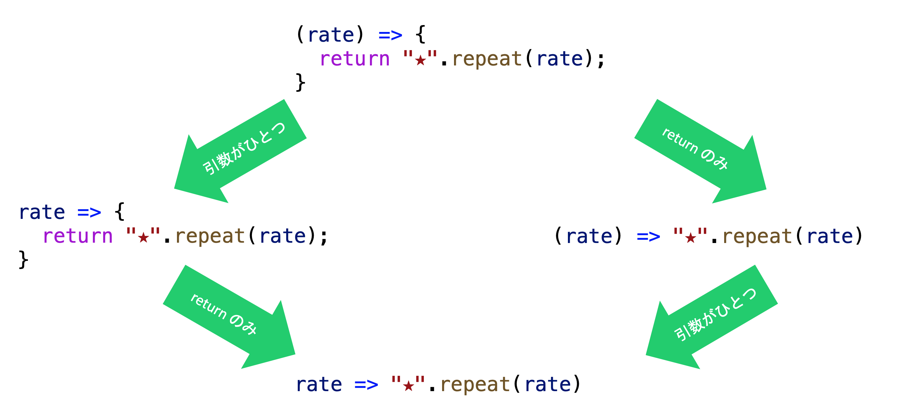

import CodeBlock from '@theme/CodeBlock';
import Term from "@site/src/components/Term";
import OpenInCodeSandbox from "@site/src/components/OpenInCodeSandbox";

## 無名関数

[イベント](../../1-trial-session/12-events/index.md)の節で、関数もオブジェクトの一種であることを説明しました。このため、関数は通常の値と同じように変数やプロパティに代入したり、関数の引数や戻り値になったりできます。

しかしながら、通常の記法で関数を記述することが煩わしい場合があります。イベントハンドラを登録する場合を考えてみましょう。

```html title=index.html
<button id="strange-button">Click me</button>
```

```javascript title=script.js
function onStrangeButtonClick() {
  alert("こんにちは！"); // ダイアログボックスを表示
}

document.getElementById("strange-button").onclick = onStrangeButtonClick;
```

<OpenInCodeSandbox path="/docs/2-browser-apps/06-anonymous-function/samples/normal-event-handler" />

この場合、関数 `onStrangeButtonClick` は、イベントハンドラとして登録されるためだけに利用されており、`onStrangeButtonClick` という名前自体はあまり重要ではありません。こういった場合、関数オブジェクトの生成をするための式（関数式）を用いることができます。このようにして生成された関数は、名前を持たないため、**無名関数**と呼ばれます。

先ほどのプログラムを関数式を用いて書き換えると、次のようになります。

```javascript title=script.js
document.getElementById("strange-button").onclick = () => {
  alert("こんにちは！");
};
```

<OpenInCodeSandbox path="/docs/2-browser-apps/06-anonymous-function/samples/using-anonymous-function" />

JavaScript における関数式の構文は、次のとおりです。`=>` の記号が特徴的な構文となっています。

```javascript
(引数1, 引数2) => {
  処理;
};
```

:::tip 無名関数を用いて関数定義を書き換える
通常の関数定義の構文は、ほとんど関数式を使用して書き換えることができます。次のプログラムにおいて、`add1` と `add2` はほとんど等価なものとみなすことができます。

```javascript
function add1(a, b) {
  return a + b;
}

const add2 = (a, b) => {
  return a + b;
};
```
:::

:::tip アロー関数
この項で扱った無名関数式を、`=>` 記号が矢のように見えることから、<Term type="arrowFunction" strong>アロー関数</Term>と呼ぶことがあります。JavaScript には、アロー関数の他にもう一つ、無名関数を記述する方法があります。

```javascript
const add3 = function (a, b) {
  return a + b;
};
```

古い文献ではこちらの記法が採用されている場合がありますが、現代ではほとんど用いられません。
:::

## 無名関数を用いると便利な関数

[`Array#map` メソッド](https://developer.mozilla.org/ja/docs/Web/JavaScript/Reference/Global_Objects/Array/map)は、関数オブジェクトの引数をひとつとり、配列の各要素に適用した上で、その戻り値からなる新しい配列を返します。

このように、外部から呼び出される関数のことを**コールバック関数**と呼びます。

```javascript
const rates = [3, 5, 1];
const stars = rates.map((rate) => {
  return "★".repeat(rate);
});
document.write(stars); // ★★★,★★★★★,★
```

:::tip プリミティブ値のラッパーオブジェクト
数値や文字列、論理値には、それぞれ対応するクラスが存在し、そのクラスのメソッドが使用できます。[クラスとインスタンスの節](../04-class/index.md)でこうしたプリミティブ値に対して `toString` メソッドが使用できたのは、これらのクラスが `Object` クラスを継承しているからです。

| プリミティブ値 | 対応するクラス                                                                                   |
| -------------- | ------------------------------------------------------------------------------------------------ |
| 数値           | [Number](https://developer.mozilla.org/ja/docs/Web/JavaScript/Reference/Global_Objects/Number)   |
| 文字列         | [String](https://developer.mozilla.org/ja/docs/Web/JavaScript/Reference/Global_Objects/String)   |
| 論理値         | [Boolean](https://developer.mozilla.org/ja/docs/Web/JavaScript/Reference/Global_Objects/Boolean) |

上のプログラムで使用されているのは[`String#repeat` メソッド](https://developer.mozilla.org/ja/docs/Web/JavaScript/Reference/Global_Objects/String/repeat)で、文字列を指定された回数繰り返した文字列を返すメソッドです。
:::

## アロー関数の省略形

アロー関数は、内部の処理が `return` 文のみの場合、波括弧を省略して式のみを記述できます。また、引数がひとつだけの場合、引数を囲む括弧を省略できます。前項のサンプルプログラムは、次のように省略可能です。本資料では、前者の省略記法のみを用いることにします。

```javascript
const stars = rates.map((rate) => "★".repeat(rate));
```



## 課題

`scores` 変数には、各必修科目の点数が格納されているとします。全ての要素が 50 点以上であることを確認するには、何というメソッドを使うのが適切か調べてみてください。また、実際にそのメソッドを用いて点数を確認してみてください。

```javascript
const scores = [90, 65, 70, 55, 80];
if (/* すべての点数が 50 点以上なら */) {
  document.write("進級できます");
}
```

:::info ヒント
「全ての要素が特定の条件を満たすかどうか」を調べるメソッドがあります。
:::

<details>
  <summary>解答</summary>
  <div>
    <p><code>Array#every</code>メソッドを使うと、配列の全要素が指定された関数でテストできます</p>
    <CodeBlock language="javascript">{`
const scores = [90, 65, 70, 55, 80];
if (scores.every((score) => score > 50)) {
  document.write("進級できます");
}
    `.trim()}</CodeBlock>
    <OpenInCodeSandbox path="/docs/2-browser-apps/06-anonymous-function/samples/every" />
  </div>
</details>

(発展) [`Array#reduce` メソッド](https://developer.mozilla.org/ja/docs/Web/JavaScript/Reference/Global_Objects/Array/reduce)は、`Array` クラスのメソッドの中でも特に使い方の難しいメソッドです。ドキュメントをよく読み、このメソッドを用いて配列の最小値を求めてみましょう。

```javascript
const scores = [90, 65, 70, 55, 80];
const minScore = scores.reduce(/* コールバック関数 */);
document.write(minScore); // 55
```

<details>
  <summary>解答</summary>
  <div>
    <CodeBlock language="javascript">{`
const scores = [90, 65, 70, 55, 80]
const minScore = scores.reduce((previousValue, currentValue) => {
    if (previousValue > currentValue) {
      return currentValue;
    };
  return previousValue;
  }
);
document.write(minScore); // 55
    `.trim()}</CodeBlock>
    <OpenInCodeSandbox path="/docs/2-browser-apps/06-anonymous-function/samples/reduce" />
  </div>
</details>
