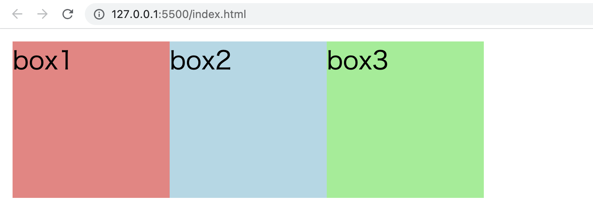

import CodeBlock from '@theme/CodeBlock';
import Term from "@site/src/components/Term";
import OpenInCodeSandbox from "@site/src/components/OpenInCodeSandbox";
import ExternalVideoPlayer from "@site/src/components/ExternalVideoPlayer";

## CSS のボックスモデル

HTMLの要素はすべて、一定の高さと幅を持った四角形だと考えることができます。その四角形は
- content（中身）
- padding（中身と境界線の間の幅）
- border（境界線）
- margin（境界線の外側の余白）
の4重構造になっています。

体験会の[ウェブサイトの見た目を整える](https://learn.utcode.net/docs/trial-session/css/)ページの課題を例に構造を見てみましょう。

```html title=index.html
<!DOCTYPE html>
<html lang="ja">
  <head>
    <meta charset="utf-8" />
    <title>Title</title>
    <link rel="stylesheet" href="style.css" />
  </head>
  <body>
    <div class="box">Foo</div>
  </body>
</html>
```

```css title="style.css"
.box {
    margin: 30px;
    padding: 30px;
    border: 10px solid #AAA;
    border-radius: 10px;
    box-shadow: 0px 0px 2px 1px #AAA;
}
```
このページを開発者ツールを使って見てみましょう。


4重に色分けされた構造が見えます。
`content`は主に`width`や`height`などのプロパティを、
`padding`, `border`, `margin`はそれぞれ主に`padding`, `border`, `margin`などのプロパティを操作することで制御できます。

`width`, `height`, `padding`, `border`, `margin`の値を変えると開発者ツールの表示がどう変わるか試してみましょう。

<!-- <OpenInCodeSandbox path="/docs/2-browser-apps/07-advanced-css/_samples/separate-css-files" /> -->

## ブロックレベル要素とインライン要素
HTMLの要素は、ブロックレベル要素とインライン要素に分類されます。

ブロックレベル要素は見出しや段落、表など、文章を構成する基本単位となる要素です。

常に前後に改行が入り、可能なところまで（親要素いっぱいまで）左右に広がります。

そのため、ブロックレベル要素を複数並べて書くと、上から下へと配置されていきます。

ブロックレベル要素には`<div></div>`や`<p></p>`、`<table></table>`、`<ul></ul>`などがあります。

以下ではブロックレベル要素である`<div></div>`を3つ並べています。

```html title="index.html"
<!DOCTYPE html>
<html lang="ja">
  <head>
    <meta charset="utf-8" />
    <title>Title</title>
    <link rel="stylesheet" href="style.css" />
  </head>
  <body>
    <div class="box1">box1</div>
    <div class="box2">box2</div>
    <div class="box3">box3</div>
  </body>
</html>
```

```css title="style.css"
.box1{
    background-color: lightcoral;
}

.box2{
    background-color: lightblue;
}

.box3{
    background-color: lightgreen;
}
```


インライン要素は文章の一部や表の要素など、ブロックレベル要素の内容となる要素です。

前後に改行は伴わず、必要な幅だけを占有します。

そのため、インライン要素を複数並べて書くと、左から右へと配置されていきます。

インライン要素には`<span></span>`や`<a></a>`、``や`<input>`があります。

以下ではインライン要素である`<span></span>`を3つ並べています。

```html title="index.html"
<!DOCTYPE html>
<html lang="ja">
  <head>
    <meta charset="utf-8" />
    <title>Title</title>
    <link rel="stylesheet" href="style.css" />
  </head>
  <body>
     <span class="box1">box1</span>
     <span class="box2">box2</span>
     <span class="box3">box3</span>
  </body>
</html>
```

```css title="style.css"
.box1{
    background-color: lightcoral;
}

.box2{
    background-color: lightblue;
}

.box3{
    background-color: lightgreen;
}
```


ブロックレベル要素の中にはブロックレベル要素もインライン要素も配置することができますが、インライン要素の中にブロックレベル要素を配置することはできません。

また、インライン要素の場合、`width` や `height` は適用されません。

### 課題

`display` 要素を操作することで要素の挙動を変更することができます。

上記のコードで、ブロックレベル要素である `<div></div>` に `display: inline` を、インライン要素である `<span></span>` に `display: block` を指定してみると表示はどう変わるか、試してみましょう。

## フレックスボックス

フレックスボックスを利用すると、要素を横や縦に並べたり、間隔を均等に取って並べたり、順番を指定して並べたりといった柔軟な配置を簡単に行うことができます。

フレックスボックスを利用するには、配置したい要素の**親要素**に `display: flex` を適用します。

以下のように、`box1`, `box2`, `box3`という3つの`<div></div>`が`wrapper`という`<div></div>`の中に並んでいる状態を考えましょう。

```html title="index.html"
<!DOCTYPE html>
<html lang="ja">
  <head>
    <meta charset="utf-8" />
    <title>Title</title>
    <link rel="stylesheet" href="style.css" />
  </head>
  <body>
    <div class="wrapper">
      <div class="box1">box1</div>
      <div class="box2">box2</div>
      <div class="box3">box3</div>
    </div>
  </body>
</html>
```

```css title="style.css"
.box1{
    background-color: lightcoral;
}

.box2{
    background-color: lightblue;
}

.box3{
    background-color: lightgreen;
}
```

このままだとブロックレベル要素である `<div></div>` が並んでいるだけなので、`box1`, `box2`, `box3` は縦に並んで表示されます。


`box1`, `box2`, `box3` の親要素である `wrapper` に `display: flex` を指定すると、要素は横並びに表示されます。



<br>

フレックスボックスを使用すると複雑な配置も簡単に実現できます。

一つの例として、`justify-content: space-around` を `wrapper`に指定してみると、要素の周囲に同じだけの間隔が空きます。


他にもたくさんの配置が実現可能なので、調べてみましょう。

