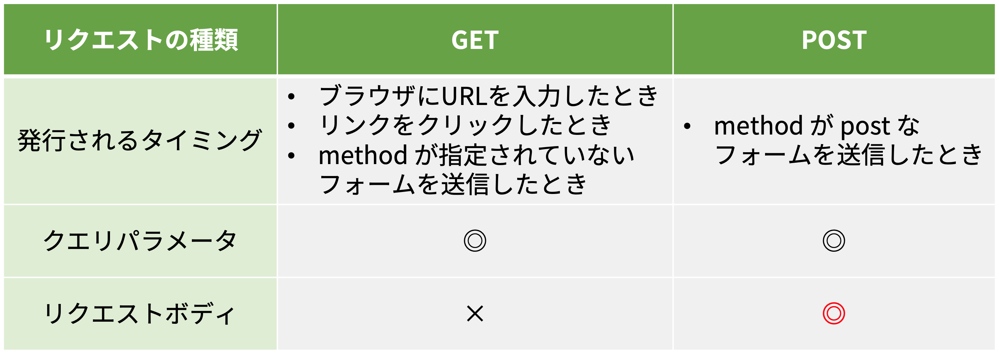

import CodeBlock from '@theme/CodeBlock';
import Term from "@site/src/components/Term";
import OpenInCodeSandbox from "@site/src/components/OpenInCodeSandbox";
import postInDevelopment1 from "./postInDevelopment1.mp4";
import postInDevelopment2 from "./postInDevelopment2.mp4";
import postInDevelopment3 from "./postInDevelopment3.mp4";

## GET リクエストと POST リクエスト

HTTP 上の通信において<Term type="serverClient">クライアント</Term>から<Term type="serverClient">サーバー</Term>への要求を<Term type="httpRequestResponse">リクエスト</Term>と言いましたが、今まで扱ってきたのはその中でも <Term type="httpMethod" strong>GET リクエスト</Term>と呼ばれるものになります。

GET リクエストで<Term type="serverClient">サーバー</Term>にデータを送信する場合、前頁で扱ったように、<Term type="queryString">クエリパラメータ</Term>として URL の末尾に付加するしかありませんが、この方式だと困ってしまうことがあります。例えばパスワードなどを入力したときに URL にパスワード情報が載ってしまい機密情報の漏洩につながります。また、URL の長さの制限のため、大量の情報は送信できません。

そこで用いるのが **POST リクエスト**です。POST リクエストでは、クエリパラメータとは別に、<Term type="httpHeaderBody">リクエストボディ</Term>と呼ばれる領域を使って大容量のデータを送信できます。

HTTP リクエストのこのような区分を、<Term type="httpMethod" strong>メソッド</Term>と呼びます。



前頁の例を、POST リクエストを用いて書き直してみましょう。`form` 要素の `method` 属性に `post` を指定することで、ブラウザは送信ボタンが押されたときに `POST` メソッドのリクエストを発行します。

```html title="static/index.html"
<!DOCTYPE html>
<html lang="ja">
  <head>
    <meta charset="utf-8" />
    <title>フォーム</title>
  </head>
  <body>
    <form method="post" action="/send">
      <input name="name" />
      <input name="age" />
      <button>送信</button>
    </form>
  </body>
</html>
```

```javascript title="main.js"
const express = require("express");

const app = express();

app.use(express.urlencoded({ extended: true }));
app.use(express.static("static"));

app.post("/send", (request, response) => {
  response.send(
    `あなたの名前は${request.body.name}で、${request.body.age}歳ですね。`
  );
});
app.listen(3000);
```

<OpenInCodeSandbox path="/docs/3-golden-week/06-get-post/_samples/post-request" />

これまで利用していた `app.get` ([`express.Application#get` メソッド](https://expressjs.com/ja/api.html#app.get.method)) では、GET メソッドのリクエストしか受け付けられないため、`/send` への POST リクエストを受け付けるために `app.post` ([`express.Application#post` メソッド](https://expressjs.com/ja/api.html#app.post.method)) を利用しています。

クエリパラメータにアクセスするには、`request.query` ([`express.Request#query` プロパティ](https://expressjs.com/ja/api.html#req.query)) を使用しましたが、リクエストボディを使用するには、`request.body` ([`express.Request#body` プロパティ](https://expressjs.com/ja/api.html#req.body)) を使用します。

`app.use(express.urlencoded({ extended: true }));` は、リクエストボディの解釈方法を定めています。HTML のフォームが送信されたとき、ブラウザが発行する POST リクエストのリクエストボディは、クエリパラメータと同じく URL エンコードされた形式で記述されます。[`express.urlencoded` 関数](https://expressjs.com/ja/api.html#express.urlencoded)は、URL エンコードされたリクエストボディを読み取り、`request.body` にオブジェクトの形式でデータを保存する役割を担っています。

このシステムでは、まず次のような画面が表示されます。


以下のように入力して、送信ボタンをクリックすると


`http://localhost:3000/send` に移り、以下のような画面が表示されます。GET リクエストの時と違い、クエリパラメータが URL に表示されていないことが分かります。


## POST リクエストを開発者ツールで覗いてみる

実際に POST リクエストの中身がどうなっているか覗いてみましょう。まず開発者ツールを開き、文字を入力して送信してみます。

<video src={postInDevelopment1} controls />

そして `name` 欄の `send` をクリックし、 `Headers` を選択すると `general` 欄の `Requested method` が `POST` になっています。また、 `Headers` の横にある `Payload` を選択し `Form data` を見ると、 `name` と `age` の情報が載っています。

<video src={postInDevelopment2} controls />

ここからさらに、`Form data` の横の `view source` や `view URL-encoded` も見てみましょう。するとURLエンコードされたリクエストボディの中身を見ることができます。

<video src={postInDevelopment3} controls />

以上のようにして、POSTリクエストの中身を覗くことができます。


## 課題

古き良き掲示板システムを作ってみましょう。次のようなページを作成してください。

- `GET /`: 現在の投稿されているすべての記事を表示します。`/send` へ POST するためのフォームも同時に表示します。
- `POST /send`: リクエストボディに含まれている記事の内容を記録します。

:::tip ヒント
- イベントハンドラの外側に現在投稿されたデータを記録するための配列を用意しましょう。
- `GET /` では EJS を用いて配列の中身を一覧表示しましょう。フォームも忘れずに表示しましょう。
- `POST /send` に新しい投稿が来たら `Array#push` メソッドで配列に要素を追加しましょう。
:::
