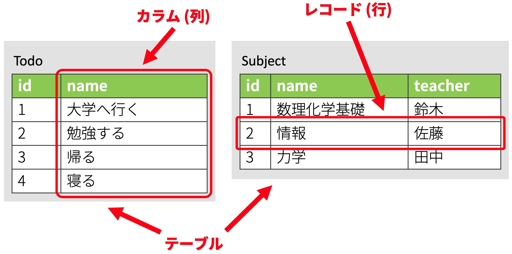
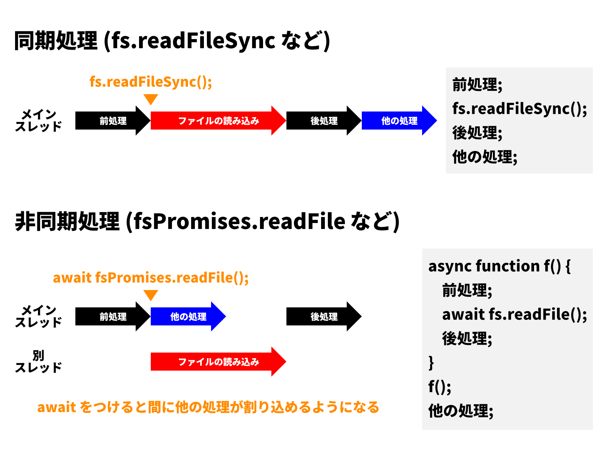
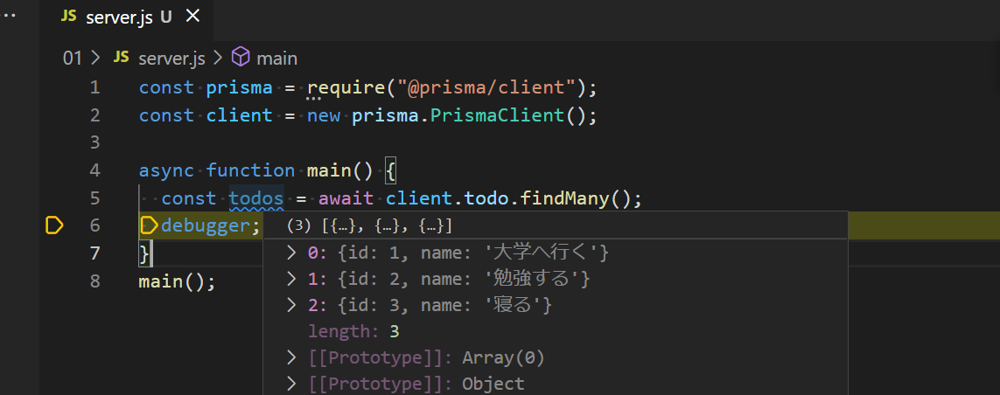
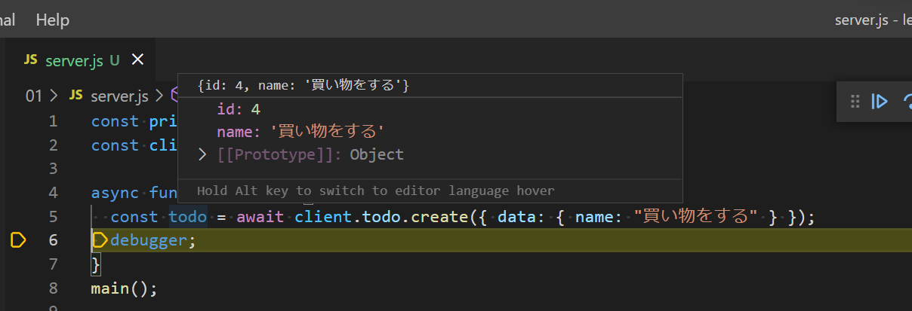

import CodeBlock from '@theme/CodeBlock';
import Term from "@site/src/components/Term";
import OpenInCodeSandbox from "@site/src/components/OpenInCodeSandbox";
import newPostgresqlInstanceVideo from "./new-postgresql-instance.mp4";
import connectDbeaverToDatabaseVideo from "./connect-dbeaver-to-database.mp4";
import prismaInitVideo from "./prisma-init.mp4";
import copySecretValuesVideo from "./copy-secret-values.mp4";
import prismaDbPushVideo from "./prisma-db-push.mp4";
import createRecordInDatabaseVideo from "./create-record-in-database.mp4";

## リレーショナルデータベース

データベースサーバーは、データを保存したり、参照するための専用のサーバーです。Web の世界では、ブラウザが直接データベースサーバーと通信することはほとんどなく、基本的には Node.js などのウェブサーバーがデータベースサーバーと通信します。リレーショナルデータベースは、データベースの中でも最も多く使われる種類のもので、Excel のような表形式でデータを保持するという特徴があります。

次の図は、リレーショナルデータベースの基本的な概念である、**テーブル**、**カラム**、**レコード**について整理した図です。リレーショナルデータベースを用いる一般的なアプリケーションでは、アプリケーション開発時にテーブルとカラムを作成しておき、ユーザーの操作に応じてレコードを追加・編集・削除していきます。



## ElephantSQL で PostgreSQL を使用する

[PostgreSQL](https://www.postgresql.org) は、代表的なリレーショナルデータベースです。[ElephantSQL](https://www.elephantsql.com) を利用すると、無料のアカウント登録のみで、PostgreSQL サーバーが利用できます。

アカウント登録が完了したら、早速 PostgreSQL サーバーを起動しましょう。設定項目は多くないので簡単です。

- Plan: `Tiny Turtle (Free)`
- Data center: `AP-NorthEast-1 (Tokyo)`

<video src={newPostgresqlInstanceVideo} controls />

## DBeaver で PostgreSQL サーバーに接続する

[DBeaver](https://dbeaver.io) は、無料で公開されている非常に高機能なデータベースクライアントです。ElephantSQL で表示できる認証情報を利用して、データベースに接続できることを確認しましょう。

<video src={connectDbeaverToDatabaseVideo} controls />

この時点ではまだテーブルが作成されていないため、実際にデータを操作することはできません。DBeaver 上で作成することもできますが、今回は Prisma を使用して作成することにします。

## Prisma でテーブル構造を作成する

[Prisma](https://www.prisma.io) は、Node.js から主にリレーショナルデータベースを使用するためのライブラリです。Prisma を便利に使用するための拡張機能が VSCode 向けに用意されているので、先にダウンロードしておきましょう。


新しいフォルダを VSCode で開き、`npm init` コマンドを使用して `package.json` ファイルを作成した後、

```shell
npx prisma init
```

コマンドを実行します。パッケージを実行しても良いか尋ねられる場合は、`y` を入力して許可しましょう。

<video src={prismaInitVideo} controls muted autoPlay loop />

:::tip <Term type="npxCommand">`npx` コマンド</Term>
<p><Term type="npxCommand"><code>npx</code> コマンド</Term>は、npm のパッケージを、プログラムからではなく直接実行するためのコマンドです。npm には <code>prisma</code> パッケージのように、直接実行専用のパッケージも存在します。</p>
:::

続いて、ElephantSQL からデータベースへの接続情報を `.env` ファイルにコピーします。これにより、Prisma は ElephantSQL 上の PostgreSQL サーバーと接続できるようになります。

<video src={copySecretValuesVideo} controls muted autoPlay loop />

`prisma/schema.prisma` ファイルを、次のように編集します。`schema.prisma` ファイルは、**データベースのテーブルとカラムの構造を定義するためのファイル**です。

```javascript
// This is your Prisma schema file,
// learn more about it in the docs: https://pris.ly/d/prisma-schema

generator client {
  provider = "prisma-client-js"
}

datasource db {
  provider = "postgresql"
  url      = env("DATABASE_URL")
}

model Todo {
  id   Int    @id @default(autoincrement())
  name String
}
```

完了したら、

```shell
npx prisma db push
```

コマンドを実行しましょう。すると、データベースに `schema.prisma` に書かれた通りのテーブルとカラムが作成されるので、DBeaver で確認してみてください。接続を一旦切断し、再接続する必要があります。また、このとき、後述する `@prisma/client` パッケージが自動的にインストールされます。

<video src={prismaDbPushVideo} controls />

## DBeaver で Prisma が作成したテーブルにレコードを追加する

Prisma が作成したテーブルに、DBeaver を用いてレコードを追加しましょう。

<video src={createRecordInDatabaseVideo} controls />

## 非同期処理

Prisma を用いてデータベースの操作を行う場合には、非同期処理の概念を理解しておく必要があります。

非同期処理を使うと、メインスレッドを停止させずに時間のかかる処理（ファイルの読み書きやネットワーク通信など）を行うことができます。下のコードにおいて `sample.txt` を読み込む 3 つの関数 `sync`、`callback`、`asyncAwait` の挙動を比較してみましょう。なお、`sample.txt` には `これはサンプルです。` と記述されているものとします。

```javascript
const fs = require("fs");
const fsPromises = require("fs/promises");

function sync() {
  const buffer = fs.readFileSync("sample.txt");
  console.log(buffer.toString());
}

function callback() {
  fs.readFile("sample.txt", (error, buffer) => {
    console.log(buffer.toString());
  });
}

async function asyncAwait() {
  const buffer = await fsPromises.readFile("sample.txt");
  console.log(buffer.toString());
}

console.log("Before sync()");
sync();
console.log("After sync()");

console.log("Before callback()");
callback();
console.log("After callback()");

console.log("Before asyncAwait()");
asyncAwait();
console.log("After asyncAwait()");
```

<OpenInCodeSandbox path="/docs/3-golden-week/08-database/_samples/async-operations" />

このプログラムの結果は、次のようになります。

```plain
Before sync()
これはサンプルです。
After sync()
Before callback()
After callback()
Before asyncAwait()
After asyncAwait()
これはサンプルです。
これはサンプルです。
```

同期的な関数 `sync` では後続の `console.log("After sync()");` がファイルの中身が表示された後に実行されているのに対し、その他の 2 つでは後回しになっています。これは、この 2 つはファイルの読み込みを非同期処理で行っているからです。

`fs.readFile` を用いる方法では、第 2 引数にコールバック関数を登録します。この関数はファイルの読み込みが完了したタイミングで実行されます。関数が呼び出されるまでの間は他の処理が割り込むことができます。

`fs/promises` は `fs` と同じく Node.js の標準モジュールですが、`await` キーワードを用いて非同期処理を記述できるようになっています。`await` キーワードにより非同期処理の完了を待っている間はほかの処理が割り込めます。なお、 **`await` キーワードは `async` キーワードを付けた関数内でしか使えません**。



:::tip (発展) Promise
`async` キーワードのついた関数は、戻り値として [`Promise` クラス](https://developer.mozilla.org/ja/docs/Web/JavaScript/Reference/Global_Objects/Promise)のインスタンスを返却するようになります。この Promise クラスを用いることにより、コールバック型の非同期関数を `await` を用いることができる形に変換できます。

```javascript
const fs = require("fs");

// fsPromises.readFile を自分で実装する
function myReadFileAsync(fileName) {
  return new Promise((resolve, reject) => {
    fs.readFile(fileName, (error, buffer) => {
      if (error) {
        reject(error);
      } else {
        resolve(buffer);
      }
    });
  })
}

async function myAsyncAwait() {
  const buffer = await myReadFileAsync("sample.txt");
  console.log(buffer.toString());
}

console.log("Before myAsyncAwait()");
myAsyncAwait();
console.log("After myAsyncAwait()");
```
:::

## Prisma でデータベースのデータを読み書きする

Node.js から Prisma を利用してデータベースのデータを操作するためには、[`PrismaClient` クラス](https://www.prisma.io/docs/reference/api-reference/prisma-client-reference#prismaclient)を用います。データの取得には、次の 3 つのメソッドが利用できます。

- [`PrismaClient#[テーブル名].findMany` メソッド](https://www.prisma.io/docs/reference/api-reference/prisma-client-reference#findmany): 条件を満たすレコードを全て取得
- [`PrismaClient#[テーブル名].findFirst` メソッド](https://www.prisma.io/docs/reference/api-reference/prisma-client-reference#findfirst): 条件を満たす最初のレコードを取得
- [`PrismaClient#[テーブル名].findUnique` メソッド](https://www.prisma.io/docs/reference/api-reference/prisma-client-reference#findunique): レコードを一意に識別できる条件を使用してレコードを 1 つだけ取得

`findMany` メソッドの戻り値を、デバッガを用いて確認してみましょう。

```javascript
const { PrismaClient } = require("@prisma/client");
const client = new PrismaClient();

async function main() {
  const todos = await client.todo.findMany();
  debugger;
}
main();
```



また、[`PrismaClient#[テーブル名].create` メソッド](https://www.prisma.io/docs/reference/api-reference/prisma-client-reference#create)を用いることで、テーブルにレコードを作成することができます。

```javascript
const { PrismaClient } = require("@prisma/client");
const client = new PrismaClient();

async function main() {
  const todos = await client.todo.create({ data: { name: "買い物をする" } });
  debugger;
}
main();
```



## 課題

[前頁](../06-get-post/index.md)で作成した ToDo リストのアプリケーションのデータが、データベース上に保存できるようにしてみましょう。

