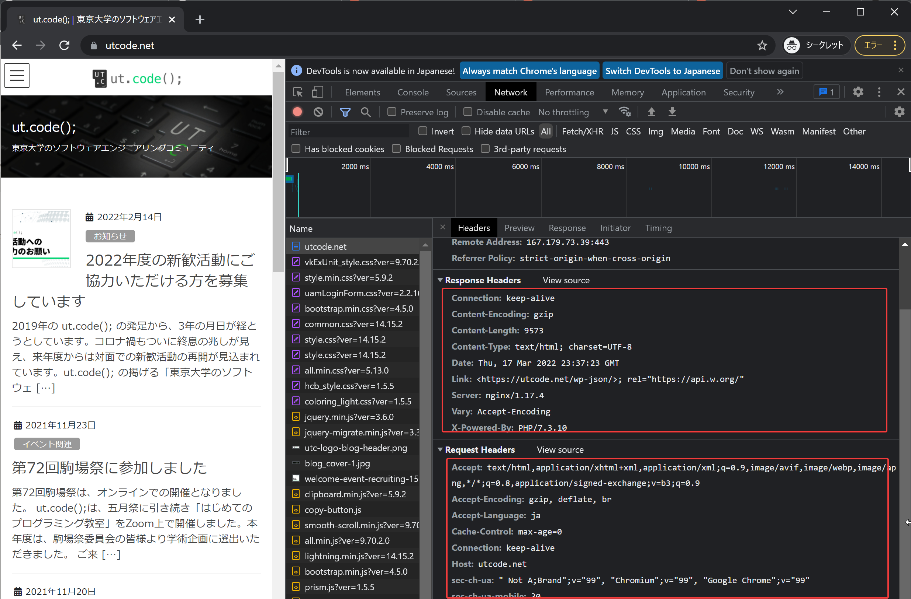

import CodeBlock from '@theme/CodeBlock';
import Term from "@site/src/components/Term";
import OpenInCodeSandbox from "@site/src/components/OpenInCodeSandbox";
import cookieCounterVideo from "./cookie-counter.mp4";

## HTTP ヘッダ

HTTP におけるリクエストとレスポンスには、**ヘッダ**と呼ばれる Key-Value 型のデータ構造が毎回付加されています。Chromeの開発者ツールでの `Network` タブで確認できるので、確認してみましょう。



## Cookie

レスポンスヘッダに `set-cookie` ヘッダを含めることにより、次回以降のリクエストで、クライアントはそのデータをリクエストヘッダの `cookie` ヘッダに入れて毎回送信します。この性質を利用することで、HTTP サーバーはクライアント毎に異なるサービスを提供できるようになります。

Cookie 自体も Key-Value のデータ構造となっているので、`set-cookie` ヘッダを複数回送信することにより、複数のcookieを1つのレスポンスで送信することができます。例として、[Yahoo! Japan のウェブサイト](https://www.yahoo.co.jp/) にアクセスした際に、Yahoo! Japan が送信する Cookie の中身を除いてみましょう。


このレスポンスヘッダを受けて、ブラウザは次のような Cookie を保存します。


ブラウザを更新することで、設定された Cookie が確かにリクエストヘッダの中に含まれて送信されていることがわかります。


## Express で Cookie を利用する

Express を用いてレスポンスヘッダに Cookie を付加するには、[`express.Response#cookie` メソッド](https://expressjs.com/ja/api.html#res.cookie)を利用します。また、クライアントからのリクエストの `cookie` ヘッダを解析するためには、[cookie-parser](https://www.npmjs.com/package/cookie-parser) パッケージを利用します。

```shell
npm install cookie-parser
```

を実行して、パッケージをインストールしましょう。Web サーバーのプログラムは次のようになります。

```javascript
const express = require("express");
const cookieParser = require("cookie-parser");

const app = express();
app.use(cookieParser());

app.get("/", (request, response) => {
  // Cookie の値は文字列なので数値に変換が必要
  const count = parseInt(request.cookies.count) || 0;
  const newCount = count + 1;
  // 変更後の値をレスポンスヘッダに乗せる
  response.cookie("count", newCount.toString());
  response.send(`${newCount}回目のアクセスですね。`);
});

app.listen(3000);
```

[`express.Request#cookies` プロパティ](https://expressjs.com/ja/api.html#req.cookies) には、ブラウザから送信されていた Cookie がオブジェクト形式で保存されています。ブラウザで表示させると、更新ボタンが押されるたびに数値が増えていることがわかります。

<video src={cookieCounterVideo} controls muted autoPlay loop />

プログラムの流れを整理すると、次の図のようになります。


### 課題

- Chrome の開発者ツールを用いて、リクエストヘッダとレスポンスヘッダの内容を確認してみましょう。
- シークレットモードでページを開くと値はどうなるでしょうか。

## Cookie を用いた認証

ユーザー名とパスワードを用いて認証するタイプのアプリケーションを考えてみましょう。ユーザー名とパスワードを、そのまま Cookie に入れてしまうと、データが悪意のある第三者に奪われてしまうリスクが高まります。

このため、ログインが成功したタイミングで、クライアントに対してランダムな ID を発行し、Cookieに保存させておくことが一般的です（**セッション ID** と呼ばれる）。次回以降のアクセスでは、このセッション ID を用いて認証を行います。このフローを図にすると、次のようになります。


### 課題

ユーザーが自分のユーザー名とパスワードでログインし、プロフィールを表示できるウェブアプリケーションを作成してみましょう。

`schema.prisma` は次の通りとします。

```javascript title=schema.prisma
model User {
  id       Int    @id @default(autoincrement())
  username String @unique
  password String
}

model Session {
  id     String @id // 一意でランダムなID
  userId Int // User の ID
}
```
