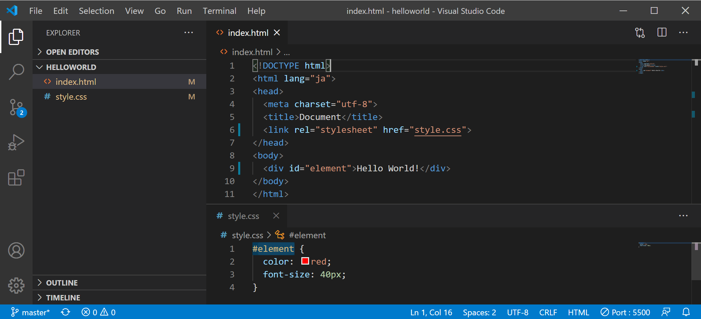

今まで学習してきた HTML は、あくまで**文書の構造**を表現することしかできませんでした。**CSS**を用いると、HTML によって形作られた文書構造を、極めてリッチに装飾することができます。

## `style`属性を使用して CSS を使ってみる

以下のような HTML ファイルを作成しましょう。

```html
<div style="color: red; font-size: 40px;">Hello World</div>
```

:::caution
これ以降、HTML を記述する際は、必要な部分のみを記述するものとします。例えば、上記の例であれば、実際の HTML ファイルは

```html
<!DOCTYPE html>
<html lang="ja">
  <head>
    <meta charset="utf-8" />
    <title>Document</title>
  </head>
  <body>
    <div style="color: red; font-size: 40px;">Hello World</div>
  </body>
</html>
```

となるのでしょうが、今回関心があるのは`body`タグの内部のみです。
:::

上記の例の実行結果は、以下のようになるはずです。

> <div style={{ color: "red", fontSize: "40px", margin: 0 }}>Hello World</div>

CSS は、`プロパティ名: 値;`の形式で記述します。上記の例で使われている`color`プロパティは文字色を設定するため、`font-size`プロパティは文字サイズを指定するためのプロパティです。セミコロンで区切って複数のプロパティを使用することができます。

## CSS を別ファイルに分離する

Web サイトの見た目に対する社会の要求の高まりに応えて CSS のプロパティの種類は増え続け、現在ではとても数えきれないほどとなっています。CSS の記述量は HTML のそれとは比較にならないほど多い場合がほとんどです。

このため、CSS をすべて`style`属性で記述するのは現実的ではありません。数が多すぎて、見通しが悪くなってしまうからです。このため、通常 CSS ファイルは HTML ファイルとは別に用意します。



CSS ファイルの拡張子は通常`.css`です。今回は`index.html`と併せて`style.css`を作成しました。

```html title="index.html"
<!DOCTYPE html>
<html lang="ja">
  <head>
    <meta charset="utf-8" />
    <title>Document</title>
    <link rel="stylesheet" href="style.css" />
  </head>
  <body>
    <div id="element">Hello World!</div>
  </body>
</html>
```

```css title="style.css"
#element {
  color: red;
  font-size: 40px;
}
```

まず注目すべきは`link`タグです。`href`属性を指定することにより、外部に作成した CSS ファイルを読み込ませることができます。

外部 CSS ファイルの中身は`color: red; font-size: 40px;`だけというわけにはいきません。なぜなら、この CSS が HTML 上のどの要素に適用されるのかを指定しなければならないからです。

その役割を担っているのが**セレクタ**、この例では`#element`の部分です。「`id`属性が`element`である要素」を示します。`id`属性は、HTML 要素に対して開発者が自由に設定できますが、1 ページ内に同じ`id`属性を持つ要素が複数存在してはならない、というルールがあります。

これに対し、`class`属性は、開発者が好きな値を設定できるのは同じですが、同じ値を複数の要素が持つことを許されています。また、スペース区切りで複数の複数の値を設定することもできます。セレクタは、`.element`のようにドット記号に続けて記述します。

| セレクタ   | 意味                                 |
| ---------- | ------------------------------------ |
| `#element` | `id`属性が`element`である要素        |
| `.element` | `class`属性に`element`が含まれる要素 |
| `element`  | タグ名が`element`である要素          |

また、セレクタをスペースで区切ると子孫要素、`>`で区切ると直属の子要素を表すことができます。そのまま繋げば and 条件とみなされます。

| セレクタ         | 意味                                                                     |
| ---------------- | ------------------------------------------------------------------------ |
| `div.element`    | `class`属性に`element`が含まれる`div`要素                                |
| `#parent .child` | `id`属性が`parent`である要素の子孫の、`class`属性に`child`が含まれる要素 |
| `#parent > div`  | `id`属性が`parent`である要素の直属の子の`div`要素                        |

セレクタを上手に活用すると、HTML を最小限必要なものに抑えながら、変更に強くて柔軟な CSS を作成することができます。
