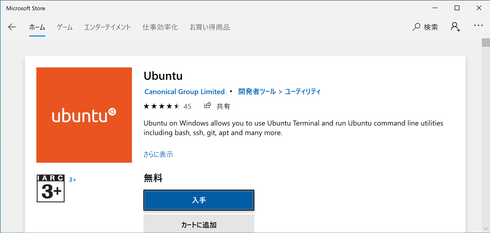
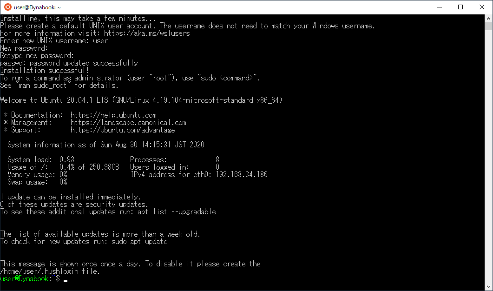
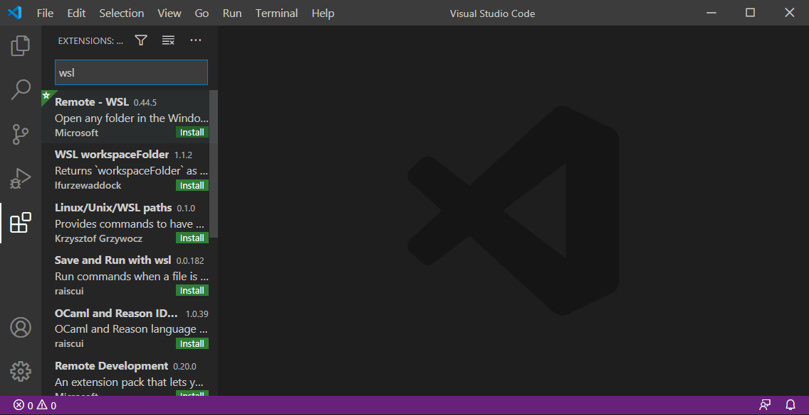

:::info
競技プログラミング等で既に WSL1 を使用している場合は、[こちら](https://docs.microsoft.com/ja-jp/windows/wsl/install-win10#set-your-distribution-version-to-wsl-1-or-wsl-2)を参考に、

- 開発に使用するディストリビューションの WSL バージョンを 2 にする
- WSL のデフォルトバージョンを 2 にする

を行ってください。
:::

:::caution
この記事では、非常に新しい技術について扱っています。内容が実際と異なる場合があるので、必ず[Microsoft の記事](https://docs.microsoft.com/ja-jp/windows/wsl/install-win10)を併せて確認してください。
:::

新しいバージョンの Windows には、WSL（Windows Subsystem for Linux）と呼ばれる、Windows 内で Linux を動作させるための仕組みが用意されています。最近、WSL のバージョン 2 が登場し、完全な Linux を使用できるようになりました。これ以後の全ての Windows 上での開発は、WSL2 上で行うことを前提とします。

## WSL の有効化と WSL2 の設定

WSL2 は、Windows 10 のバージョン 2004 以降で正式に利用できます。設定画面から Windows のバージョンを確認し、これより前の状態であった場合は Windows Update をするとよいでしょう。


PowerShell またはコマンドプロンプトを管理者権限で起動します。


以下のコマンドを用いて WSL と仮想マシン プラットフォームを有効にします。有効化が終わったら、端末を再起動してください。

```
dism.exe /online /enable-feature /featurename:Microsoft-Windows-Subsystem-Linux /all /norestart
dism.exe /online /enable-feature /featurename:VirtualMachinePlatform /all /norestart
```


再起動が完了したら、WSL2 を有効にします。以下のコマンドを実行してください。こちらは管理者権限は必要ありません。

```
wsl --set-default-version 2
```

「WSL 2 を実行するには、カーネル コンポーネントの更新が必要です。詳細については https://aka.ms/wsl2kernel を参照してください」と表示された場合は、[WSL 2 Linux カーネルの更新](https://aka.ms/wsl2kernel)を参考にしてください。


「WSL 2 との主な違いについては、https://aka.ms/wsl2 を参照してください」のように表示されたら完了です。


## Ubuntu のセットアップ

Microsoft Store から Ubuntu をインストールします。Ubuntu は、Linux のディストリビューション（Linux の上に様々なソフトウェアを加えたもの）の、最もポピュラーなもののひとつです。



Ubuntu を起動すると、Ubuntu で使用するユーザー名とパスワードの入力が求められます。必ず英数字で入力してください。



おめでとうございます。WSL が使用可能になりました。

## VSCode を WSL で使用する

`Visual Studio Code Remote - WSL`拡張機能を用いると、VSCode を WSL 上で動作させることができ、あたかも Linux 上で開発をしているかのような体験を得ることができます。



拡張機能のインストールが完了したら、コマンドパレットから`Remote-WSL: New Window`を選択します。


正しくウィンドウが開けたら成功です。

## Git の設定をする

WSL は Windows から独立しているため、Windows 環境でインストールした Git は WSL 上では使用できません。しかしながら、幸いなことに Ubuntu では Git が標準でインストールされています。以前の記事を参考に、SSH 鍵の生成と、メールアドレス・ユーザー名の設定を行いましょう。

```
$ ssh-keygen -t ed25519
$ git config --global user.email [ダミーのメールアドレス]
$ git config --global user.name [GitHubのユーザー名]
```

SSH 公開鍵を表示するためには、

```
$ cat ~/.ssh/id_ed25519.pub
```

を実行してください。公開鍵を GitHub に登録したら、リポジトリのクローンやコミットができるかどうか確認してみましょう。

## Windows のエクスプローラーで WSL 上のファイルにアクセスする

WSL 上では、通常の Windows とは完全に独立したファイルシステムが構築されています。このため、Windows 側からファイルを操作するためには、特殊な方法が必要です。

`Win + R`キーを押して`ファイル名を指定して実行`ダイアログボックスを開き、`\\wsl$`と入力します。


エクスプローラー上でインストールしたディストリビューション（この記事の手順に従った場合は`Ubuntu`）のフォルダとして表示されます。この中身がファイルシステムのルートです。
