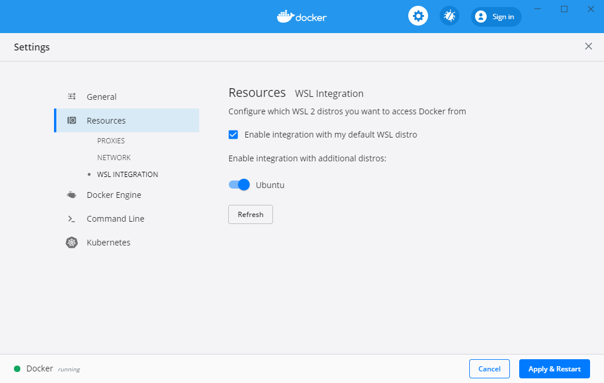
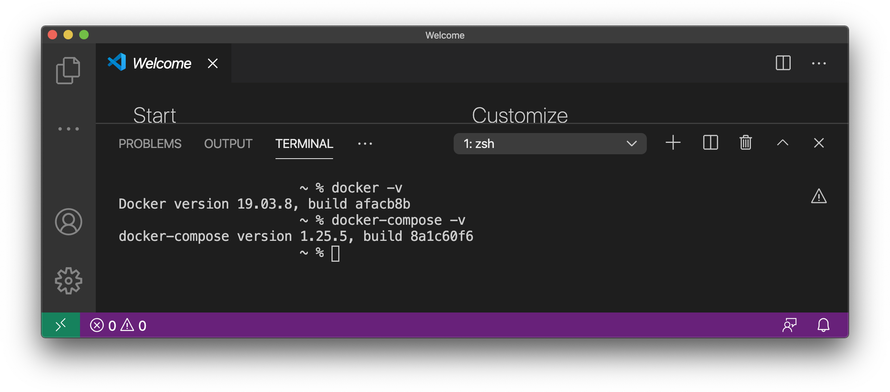

**Docker**を用いると、仮想的な Linux マシンを軽量に構築することができます。

## WSL を用いてインストールする (Windows のみ)

[こちら](https://www.docker.com/products/docker-desktop)から Docker Desktop をダウンロード・インストールします。インストール中に`Enable WSL 2 Windows Features`が表示されるので、チェックが入っていることを確認しましょう。


:::caution
このオプションが表示されない場合、WSL2 が正しく有効化できていない可能性が高いです。
:::

Docker Desktop の設定画面（タスクトレイのアイコンから起動できます）から、WSL のディストリビューション上（手順通りであれば`Ubuntu`です）で Docker が使用できるように設定します。



VS Code で WSL に接続して統合ターミナルを起動し、Docker が問題なく使用できることを確認しましょう。


```
$ docker -v
$ docker-compose -v
```

バージョン番号が表示されていれば成功です。

## macOS にインストールする

macOS での手順は非常に簡単です。[Docker Desktop](https://www.docker.com/products/docker-desktop)を何も考えずにインストールするだけです。簡単ですね。VS Code の統合ターミナルで同様に確認してください。


