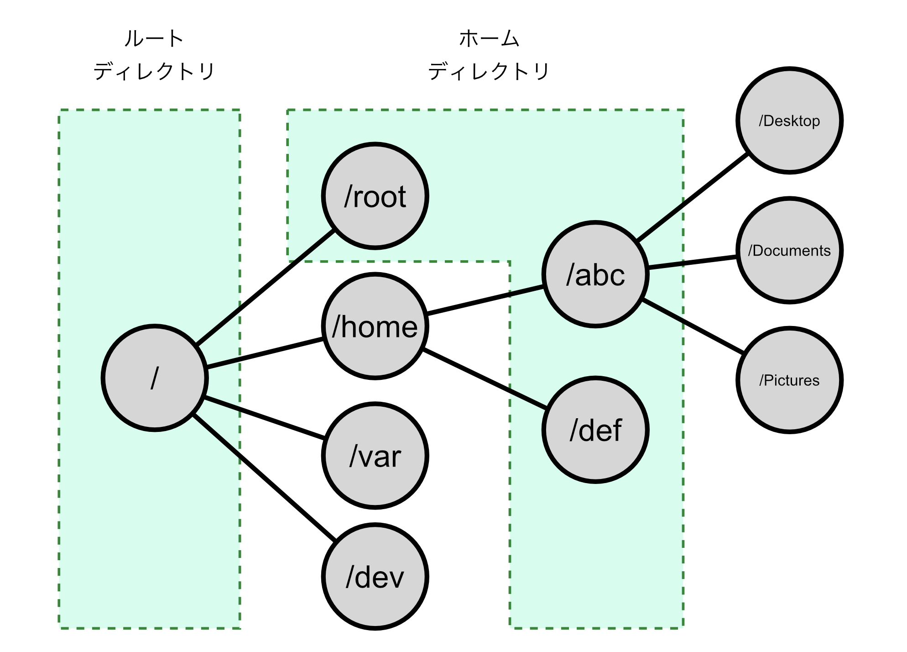

## ファイルシステム

Linuxのファイルシステムは、**ルートディレクトリ**と呼ばれる特殊なディレクトリを頂点とする木構造で表現され、この木構造の中の特定の要素を一意に表現するための表記を**パス**と呼びます。Linuxにおいてパスの区切り文字は`/`で、それが単体で利用された際はルートディレクトリを表します。例えば、ルートディレクトリの中の`home`ディレクトリの中の`utcode`という名前のディレクトリは`/home/utcode`という形で表現されます。



また、PCは複数のユーザーで使用されることを前提に設計されているため、各ユーザーが使用できる個人的な領域として「ホームディレクトリ」が作成されます。Ubuntuをはじめとした標準的なLinuxでは、ホームディレクトリは「/home/ユーザー名」にあります。

Linuxには、最初から存在している**root**と呼ばれる特殊なユーザーがあります。`root`ユーザーは、コンピューター内の全てのファイルやディレクトリにアクセスできる権限を持っています。Ubuntuでは、rootユーザーのホームディレクトリは`/root`にあります。

## 相対パスと絶対パス

現在作業対象となっているディレクトリを**カレントディレクトリ**と呼びます。すべてのファイルやディレクトリは、ルートディレクトリを基準とした**絶対パス**で表される他、カレントディレクトリからの**相対パス**で表すことができます。例えば、カレントディレクトリが`/home/utcode`のとき、`/home/utcode/pictures/xxx.jpg`は`pictures/xxx.jpg`と表されます。

Ubuntuの場合は、標準状態でカレントディレクトリがターミナル上に表示される場合が多いです。以下の例の場合は`~/projects/sample`がカレントディレクトリです。


:::tip
ターミナル上で動作し、ユーザーの入力を受け取って実際に実行するソフトウェアを**シェル**と呼びます。コマンドを入力する場所（**プロンプト**）にカレントディレクトリを表示させるか否かはシェルの設定に依存しますが、Ubuntuのデフォルトである**bash**やmacOSのデフォルトである**zsh**では、標準で表示されるようになっています。
:::

パスを表現するとき、様々な記号を用いることで、より複雑な関係を表現することができます。

| カレントディレクトリ | 目標のディレクトリ     | 相対パス                    |
| -------------------- | ---------------------- | --------------------------- |
| /foo/bar             | /foo/bar/baz           | baz 又は ./baz              |
| /foo/bar             | /foo/bar/baz/foobar    | baz/foobar又は ./baz/foobar |
| /foo/bar/baz         | /foo/bar               | .. 又は ./..                |
| /foo/bar/baz         | /foo                   | ../.. 又は ./../..          |
| どこでも             | /home/[ユーザー名]/foo | ~/foo                       |

カレントディレクトリは「.」、親ディレクトリは「..」、ホームディレクトリは「~」と表されることが分かります。

## コマンドの入力方法

コマンドはスペース区切りで入力し、最初がコマンド名、それ以降をそのコマンドの「引数」と呼びます。コマンド名や引数にスペース文字が含まれる場合は、値全体を`""`（ダブルクォーテーション）で囲むことでスペースが区切り文字として認識されることを防ぐことができます。以下にコマンドの一例を示します。

| コマンド名   | 機能                         |
| ------------ | ---------------------------- |
| pwd          | カレントディレクトリを表示   |
| ls           | ディレクトリの中身を一覧表示 |
| cd [移動先]  | カレントディレクトリを移動   |
| mkdir [名前] | 新しいディレクトリを作成     |
| touch [名前] | 新しいファイルを作成         |

## 課題

ホームディレクトリ内に以下のディレクトリ・ファイル構造を作成してください。

```
[ホームディレクトリ]
└── secret
    ├── pictures
    │   └── xxx.txt
    └── videos
        ├── yyy.txt
        └── zzz.txt
```
