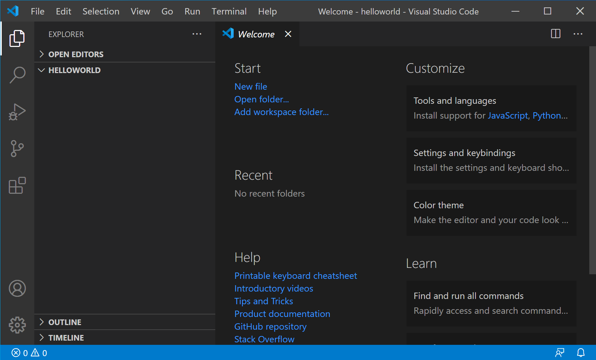

VSCodeは、ディレクトリ（フォルダ）単位でファイルを管理します。これから大量に増えていくだろうプログラムファイルを保存しておくためのディレクトリを、適当な場所に作成しましょう。それが終わったら、そのディレクトリの中に今から作るプロジェクトのためのディレクトリを作成します。名前は何でもいいですが、例えば「helloworld」などにしてみましょう。

VSCodeでディレクトリを開きます。`Ctrl (Cmd) + Shift + P`を押して`File: Open Folder...`を選択し、先ほど作成したディレクトリを選択しましょう。


なお、この`Ctrl (Cmd) + Shift + P`は、VSCodeを利用する上で非常に重要な操作です。これにより**コマンド パレット**が表示され、現在実行可能な操作が全て一覧表示されます。

:::tip 絞り込み
結構雑な絞り込みも有効です。例えば、「opfol」のように入力しても、「File: Open Folder...」が見つかります。
:::

図のように、左側のパネルに開いているディレクトリの名前が表示されれば成功です。



新しいファイルを作成して`index.html`としてください。


ファイルの中身は適当で構いません。

```html title="index.html"
hello world!
```
